# Kitchen Tales

The live link can be found here - [Kitchen Tales](https://)

## Contents

- [Kitchen Tales](#kitchen-tales)
  * [Objective](#objective)
  * [Brief & Target Audience](#brief)
  * [User Experience (UX)](#user-experience-ux)
    + [User Stories](#user-stories)
    + [Design](#design)
      - [Colour Scheme](#colour-scheme)
      - [Imagery](#imagery)
      - [Fonts](#fonts)
      - [Wireframes](#wireframes)
  * [Agile Methodology](#agile-methodology)
  * [Data Model](#data-model)
  * [Testing](#testing)
  * [Security Features](#security-features)
    + [User Authentication](#user-authentication)
    + [Form Validation](#form-validation)
    + [Database Security](#database-security)
    + [Custom error pages](#custom-error-pages-)
  * [Features](#features)
    - [Features Left to Implement](#future-features)
    - [Languages Used](#languages-used)
  - [Technologies Used](#programs-frameworks--libraries-used)
    - [Programs](#programs)
    - [Frameworks](#frameworks)
    - [Libraries](#libraries)
  - [Development](#development)
    - [GitHub](#github)
    - [Django](#django)
  * [Deployment](#deployment)
    - [Heroku](#heroku)
    - [ElephantSQL](#elephant-sql)
    - [Forking the GitHub Repository](#forking-this-repository)
    - [Making a local clone](#cloning-this-repository)
  * [Credits](#credits)
    + [Content](#content)
    + [Media](#media)
  * [Acknowledgments](#acknowledgments)

***
## Objective
#

***

## Brief & Target Audience
#
A visitor to Kitchen Tales would be someone who is most likely an adult who enjoys their food and trying new recipes
***

## User Experience (UX)
#

### User Stories
#

#### EPIC | Early Deployment
- 

#### EPIC | Initial Django Setup
- 

#### EPIC | User Recipe Management
- 

#### EPIC | Website Functionality
-

#### EPIC | Navigation
-

#### EPIC | Admin Features & Owner Objectives
-

#### EPIC | User Account Management
-

***

#### User stories not yet implemented
#

The following user stories were scoped out of the project due to time constraints and labelled as "Won't Have" on the project board on Github. It is intended that these user stories will be implemented at a later date. 

***

### Design
#
The site has a very simple and clean design which was purposely chosen in order to keep in theme with the site's goal. i.e. invoking a sense of calm in the user and reducing stress when it comes to everyday cooking. 
***

#### Colour Scheme
#
Colour palette from Coolors

***

#### Imagery
#
***

#### Fonts
#
***

#### Wireframes
#

 
Landing Page

All Recipes

Add Recipe

My Recipes

My Bookmarks

***

## Agile Methodology
#
Github projects was used to manage the development process using an agile approach. Please see link to project board [here](https://github.com/chris-townsend)

The 7 Epics listed above were documented within the Github project as Milestones. A Github Issue was created for each User Story which was then allocated to a milestone(Epic). Each User Story has defined acceptance criteria to make it clear when the User Story has been completed. The acceptance criteria are further broken down into tasks to facilitate the User Story's execution.

## Data Model
I used principles of Object-Oriented Programming throughout this project and Django’s Class-Based Generic Views.  

Django AllAuth was used for the user authentication system.

In order for the users to create recipes a custom recipe model was required. The recipe author is a foreign key to the User model given a recipe can only have one author.

The Comment model allows users to comment on individual recipes and the Recipe is a foreign key in the comment model given a comment can only be linked to one recipe. 

The diagram below details the database schema.

***
## Testing
#

Testing and results can be found [here](/TESTING.md)

***
## Security Features and Defensive Design
#
### User Authentication
#
- Django's LoginRequiredMixin is used to make sure

### Form Validation
If incorrect or empty data is added to a form, the form won't submit and a warning will appear to the user informing them what field raised the error. 

### Database Security
The database url and secret key are stored in the env.py file to prevent unwanted connections to the database and this was set up before the first push to Github.

Cross-Site Request Forgery (CSRF) tokens were used on all forms throughout this site.

### Custom error pages:

Custom Error Pages were created to give the user more information on the error and to provide them with buttons to guide them back to the site.

- 400 Bad Request - The Easy Eater is unable to handle this request.
- 403 Page Forbidden - Looks like you're trying to access forbidden content. Please log out and sign in to the correct account.
- 404 Page Not Found - The page you're looking for doesn't exist.
- 500 Server Error - The Easy Eater is currently unable to handle this request

## Features
#

### Header

**Logo**
- A customised logo was created using Hatchful by Shopify which is a free logo generator.
- This logo is positioned in the top left of the navigation bar. The logo is linked to the home page for ease of navigation for the user.

**Navigation Bar**

### Footer

- The footer section includes links to Facebook, Instagram, Twitter and Youtube.
- Clicking the links in the footer opens a separate browser tab to avoid pulling the user away from the site.

### Home Page

### User Account Pages

**Sign Up**

**Log In**

**Log Out**

- Django allauth was installed and used to create the Sign up, Log in and Log out functionality. 
- Success messages inform the user if they have logged in/ logged out successfully.

### Browse Recipes

### Recipe Detail Page

**Recipe Header Section**

**Recipe Action Buttons**

**Recipe Details Section**

**Comments Section**

### Add Recipe Form

### Update Recipe Form

### Delete Recipe

### My Recipes Page

### My Bookmarks Page

### Error Pages

Custom Error Pages were created to give the user more information on the error and to guide them back to the site.

- 400 Bad Request - 
- 403 Page Forbidden -
- 404 Page Not Found - 
- 500 Server Error - 

***

### Future Features
#
***

# Development

This site was made using [GitHub](#github) & [Gitpod](https://www.gitpod.io/). The site was further developed using [Django](#django), a Python web-framework.
## GitHub
#
### Create the repository
1. Sign into Github and navigate to [Code Institute's Gitpod template](https://github.com/Code-Institute-Org/gitpod-full-template).
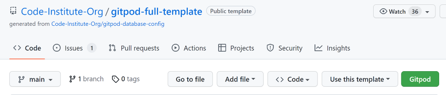
 - At the top of the repository click **Use this template** followed by **Create a new repository**.
 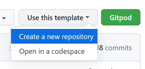

*Alternatively:*

1. Click the GitHub label in the top left of the nav section.

2. Select **New** next to **Top Repositories**.     
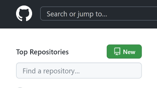

3. Select the **template** you wish to use.                
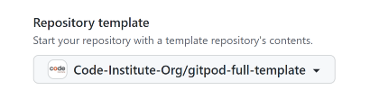

4. Give the repository a name and description and then click **Create repository**.
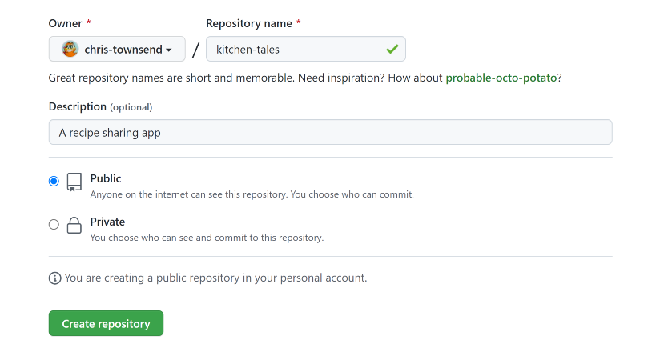

The repository has now been created and is ready for editing through the gitpod terminal.
 
***

## Django
#

***
# Deployment

## Heroku
#
To deploy this page to Heroku from its GitHub repository, the following steps were taken:

### Create the Heroku App:

1. Log in to [Heroku](https://dashboard.heroku.com/apps) or create an account.

2. On your Heroku dashboard, click the button labelled **New** in the top right corner and from the drop-down menu select **Create new app**.

3. Enter a **unique and meaningful app name** and **choose the region** which is best suited to your location.
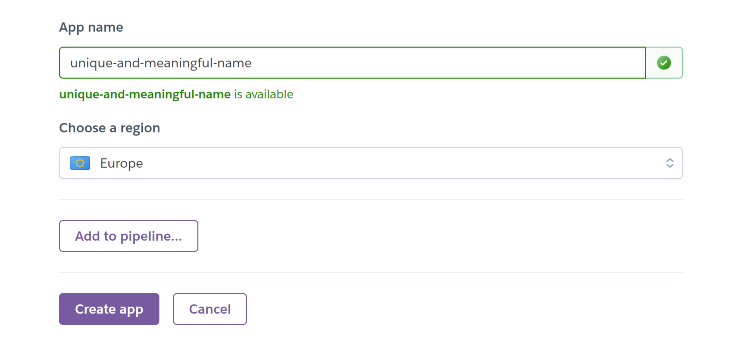
- Click on the **Create app** button.

4. Select **Settings** from the tabs at the top of the app page.

5. Click **Reveal Config Vars**.    

6. Input all key-value pairs from the `env.py` file. Ensure `DEBUG` and `DISABLE_COLLECTSTATIC` are not included in the final production.

- `SECRET_KEY` = 
- `CLOUDINARY_URL` = 
- `PORT` = `8000`
- `DISABLE_COLLECTSTATIC` = `1`

7. Below your Config Vars in your app settings, click **Add buildpack**.
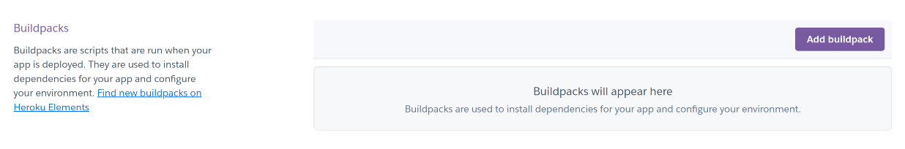

8. Select **Python** from the list of buildpacks.

- Remember to click **Save changes**.

9. Select **Deploy** from the tabs at the top of the app page.

10. Select **Connect to GitHub** from the deployment methods.

11. Search for the repository to connect to by name.

12. Click **Connect**.
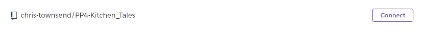

 - Your app should now be connected to your GitHub account.

 13. Select **Enable Automatic Deploys** for automatic deployments.

- If you would like to deploy manually, select **Deploy Branch**. If you manually deploy, you will need to re-deploy each time the repository is updated.

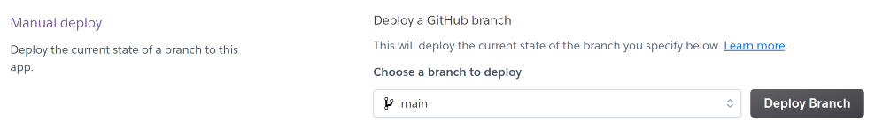

- For the first time deploying to Heroku you may have to deploy manually but if you select automatic deploys it will update from then onwards.

14. Click **View** to view the deployed site.
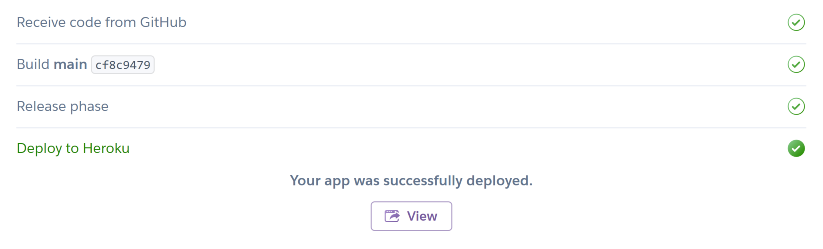

***
## Elephant SQL
#
### Create & Attach the Elephant SQL database

1. Log in to [ElephantSQL](https://customer.elephantsql.com/instance#) to access your dashboard.
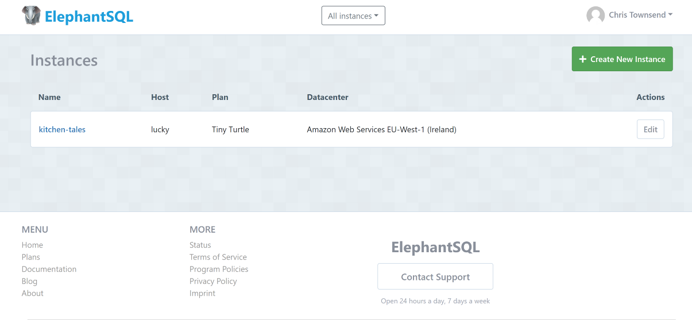

2. Click **Create New Instance** at the top right of the page.        

3. Set up your **plan**.
- Give your plan a **Name** (this is commonly the name of the project)
- Select the **Tiny Turtle (Free)** plan
- You can leave the **Tags** field blank

4. Click **Select Region**.        

5. Select a **data center** near you.

6. Click **Review**.                 

7. Ensure your details are correct and then click **Create instance**.

8. Return to the **ElephantSQL dashboard** and you should see your **database instance name** for this project.

9. On your **ElephantSQL dashboard**, click on the **database instance name** for this project.  

10. In the **URL section**, click the **copy icon** to copy the **database URL**.
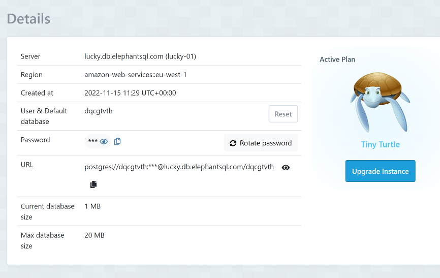

11. Within your **Heroku app**, add `DATABASE_URL` as the `KEY` and paste the URL you just copied in **ElephantSQL** into the `VALUE` column. Your **ElephantSQL** database should now be connected to your **Heroku** app.
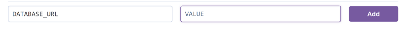

***

### Setting up the environment and settings.py file:

- In your GitPod workspace, create an env.py file in the main directory.
- Add the DATABASE_URL value and your chosen SECRET_KEY value to the env.py file. 
- Update the settings.py file to import the env.py file and add the SECRETKEY and DATABASE_URL file paths.
- Comment out the default database configuration.
- Save files and make migrations.
- Add Cloudinary URL to env.py
- Add the cloudinary libraries to the list of installed apps.
- Add the STATIC files settings - the url, storage path, directory path, root path, media url and default file storage path.
- Link the file to the templates directory in Heroku.
- Change the templates directory to TEMPLATES_DIR
- Add Heroku to the ALLOWED_HOSTS list the format ['app_name.heroku.com', 'localhost']

### Create files / directories
- Create requirements.txt file
- Create three directories in the main directory; media, storage and templates.
- Create a file named "Procfile" in the main directory and add the following: web: gunicorn project-name.wsgi

***

### Forking the GitHub Repository
#

By forking the GitHub Repository you can make a copy of the original repository You can view and/or make changes without affecting the original repository by using the following steps...

1. Log in to GitHub and locate the [GitHub Repository](https://github.com/) you would like to fork.

2. At the top of the Repository, just above the "Settings" Button on the menu, locate the "Fork" Button and you should now have a copy of the original repository in your account.

### Cloning this repository
#

1. Log in to GitHub and locate the [GitHub Repository](https://github.com/).

2. On the repository main page, click the drop-down menu called Code.

    

3. To clone the repository using HTTPS, copy the link.

    

4. Open Git Bash
5. Change the current working directory to the location where you want the cloned directory to be made.
6. Type `git clone`, and then paste the URL you copied in Step 3.

7. Press Enter. Your local clone will be created.

***
## Languages Used
#

  )

   

   

***

## Programs, Frameworks & Libraries Used
#

### Programs
#
[**Balsamiq**](https://balsamiq.com/) - Balsamiq was used to create the basic wireframes during the design process.

[**Pixlr**](https://pixlr.com/x/) - Pixlr was used to resize and change the format of my images.

[**Google DevTools**](https://developer.chrome.com/docs/devtools/) - Once the website was made to a basic deployment level, Google DevTools was used frequently to resize objects within the site, very helpful for making my website responsive.

[**Python Tutor**](https://pythontutor.com/) - Python Tutor was used for helping step through non-functioning code and resolve issues.

[**Git**](https://git-scm.com/) - Git was used for version control by utilizing the Gitpod terminal to commit to Git and Push to GitHub.

[**GitHub**](https://github.com/) - GitHub is used to store the project's code after being pushed from Git.

[**Heroku**](http://heroku.com/) - Heroku is a cloud platform that lets people build, deliver, monitor, and scale apps. It supports several programming languages. Heroku was used for the deployment of this project.

[**W3C Markup Validator**](https://validator.w3.org/) - This site was used to ensure that my HTML and CSS were error-free. I had to push my code to ensure it was updated and then add the URL of the website to the address bar which then checked for errors or warnings.

[**Favicon Generator**](https://favicon.io/favicon-converter/) - This was used to create my favicon icon. 

[**JSHint Validator**](https://jshint.com/) - Jshint was used to validate the JavaScript code. It shows any warnings and errors within my code. 

[**PEP8 Validator**](http://pep8online.com/) - The PEP8 validator was used to validate my python code, you can paste your code or upload the file to see the results. It's built with a backend Python framework called Flask. 

[**Cloudinary**](https://imgpile.com/) - A cloud hosting website, used for hosting my images.

[**DrawSQL**](https://drawsql.app/) - DrawSQL is a database diagram tool which was used to visualize relationship diagrams for my databases.

#
### Frameworks
#

[**Django 3.2**](https://www.djangoproject.com/) - A high-level Python web framework that encourages rapid development and clean, pragmatic design.
#

### Libraries 
#

[**Bootstrap 4.6**](https://getbootstrap.com/docs/4.6/getting-started/introduction/) - Bootstrap provides a popular framework for building responsive mobile-first sites with built-in CSS & Javascript libraries.

[**Psycopg2**](https://pypi.org/project/psycopg2/) - A PostgreSQL database adapter for Python.

[**dj-database-url**](https://pypi.org/project/dj-database-url/) - A simple Django utility that allows you to create an environment variable to configure your Django application.

[**Gunicorn**](https://gunicorn.org/) - Gunicorn 'Green Unicorn' is a Python WSGI HTTP Server.

[**django-all-auth**](https://github.com/pennersr/django-allauth) Integrated set of Django applications addressing authentication, registration, account management as well as 3rd party *social* account authentication.

[**django-crispy-forms**](https://django-crispy-forms.readthedocs.io/en/latest/) Used to control the rendering behaviour of my django forms.

[**django-cloudinary-storage**](https://pypi.org/project/django-cloudinary-storage/) Facillitates integration with  Cloudinary by implementing a Django Storage API. This is to enable storage of static and media files.

#
## Credits
#

- [Django Docs](https://docs.djangoproject.com/en/4.0/)
- [Bootstrap 4.6 Docs](https://getbootstrap.com/docs/4.6/getting-started/introduction/)
- [Code Institute - Blog Walkthrough Project](https://github.com/Code-Institute-Solutions/)

***

## Acknowledgments
#

