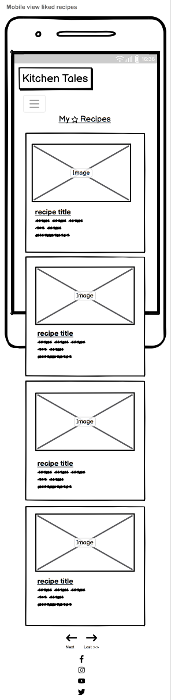

# Kitchen Tales

Kitchen Tales is a full-stack project built using Django, Python, HTML and CSS. The goal is to create a functional and responsive website that enables users to create and share recipes. The website will have full CRUD functionality, allowing users to edit and delete their own recipes. Each recipe page will have a comments section and options to like and save recipes to a favorites page.

The website follows UX design principles, is accessible and easy to navigate, allowing users to find information and resources intuitively. The site also provides role-based permissions for users to interact with a central dataset while integrating Django's built-in authentication system.

The live link can be found here - [Kitchen Tales](https://kitchen-tales.herokuapp.com/)

*Please note: To open any external links in a new browser tab, please press **CTRL + Click***

## Contents

- [Kitchen Tales](#kitchen-tales)
  * [User Experience (UX)](#user-experience-ux)
    + [Epics](#epics)
    + [User Stories](#user-stories)
      - [Future Stories](#user-stories-not-yet-implemented)
    + [Design](#design)
      - [Wireframes](#wireframes)
      - [Colour Scheme](#colour-scheme)
      - [Imagery](#imagery)
      - [Typography](#typography)
  * [Agile Methodology](#agile-methodology)
  * [Data Model](#data-model)
  * [Security Features](#security-features)
    + [User Authentication](#user-authentication)
    + [Form Validation](#form-validation)
    + [Database Security](#database-security)
    + [Custom error pages](#custom-error-pages-)
  * [Features](#features)
    - [Features Left to Implement](#future-features)
    - [Languages Used](#languages-used)
  - [Technologies Used](#programs-frameworks--libraries-used)
    - [Programs](#programs)
    - [Frameworks](#frameworks)
    - [Libraries](#libraries)
  * [Testing](#testing)
  - [Development](#development)
    - [GitHub](#github)
    - [Django](#django)
  * [Deployment](#deployment)
    - [Heroku](#heroku)
    - [ElephantSQL](#elephant-sql)
    - [Forking the GitHub Repository](#forking-this-repository)
    - [Making a local clone](#cloning-this-repository)
  * [Credits](#credits)
    + [Content](#content)
    + [Media](#media)
  * [Acknowledgments](#acknowledgments)

***

## User Experience (UX)

The target audience for Kitchen Tales would likely be individuals who are interested in cooking and looking for new recipe ideas or inspiration. This can include home cooks, food enthusiasts, and those who enjoy experimenting with different ingredients and flavors. As food is loved by most, Kitchen Tales is designed to be a place to bring food and people together. Features are designed to be intuitive so that a wide age demographic can easily use the site.

 

### Epics 

7 Epics were created as Milestones which were then further developed into 42 User Stories. The details on each epic, along with the user stories linked to each one can be found [here](https://github.com/chris-townsend/PP4-Kitchen_Tales/milestones).

[EPIC 1](https://github.com/chris-townsend/PP4-Kitchen_Tales/milestone/1) **Early Deployment**

[EPIC 2](https://github.com/chris-townsend/PP4-Kitchen_Tales/milestone/2) **Initial Django Setup**

[EPIC 3](https://github.com/chris-townsend/PP4-Kitchen_Tales/milestone/3) **Website Functionality**

[EPIC 4](https://github.com/chris-townsend/PP4-Kitchen_Tales/milestone/4) **Navigation**

[EPIC 5](https://github.com/chris-townsend/PP4-Kitchen_Tales/milestone/5) **User Recipe Management**

[EPIC 6](https://github.com/chris-townsend/PP4-Kitchen_Tales/milestone/6) **User Account Management**

[EPIC 7](https://github.com/chris-townsend/PP4-Kitchen_Tales/milestone/7) **Admin Features & Owner Objectives**

#

### User Stories

From the Epics, 42 User stories were developed. Some of my initial user stories were based around setting up the environment and deploying early. Each story was assigned a classification of must-have, should-have, could-have or won't have. Each story was also assigned user story points, based on my best estimation of the difficulty/time of completing each story. I gave the project a total of 

#

#### EPIC | **Early Deployment**

[#1](https://github.com/chris-townsend/PP4-Kitchen_Tales/issues/1) **Create Heroku App** - *As a **developer**, I can **create an account with Heroku to process setting up the app** so that **I can deploy my site to Heroku***

[#2](https://github.com/chris-townsend/PP4-Kitchen_Tales/issues/2) **Create Config Vars & static files** - *As a **developer**, I can **add my config vars to my app in Heroku** so that **I can allow deployment to production***

[#3](https://github.com/chris-townsend/PP4-Kitchen_Tales/issues/3) **Create Procfile** - *As a **developer**, I can **create a Procfile within my project** so that **the application will run in Heroku***

[#4](https://github.com/chris-townsend/PP4-Kitchen_Tales/issues/4) **Cloudinary Setup** - *As a **developer**, I can **create a Cloudinary account** so that **I can store my media files***

[#5](https://github.com/chris-townsend/PP4-Kitchen_Tales/issues/5) **Deploy using GitHub** - *As a **developer**, I can **connect my GitHub account for the final deployment stages** so that **I can allow deployment to production***

#

#### EPIC | **Initial Django Setup**

[#6](https://github.com/chris-townsend/PP4-Kitchen_Tales/issues/6) **Django Setup** - *As a **developer**, I can **set up Django and supporting libraries** so that **I can start developing the site***

[#7](https://github.com/chris-townsend/PP4-Kitchen_Tales/issues/7) **Django Secure my secret keys** - *As a **developer**, I want to **set up my environment to secure my private keys** so that **I do not expose them in an insecure way***

[#8](https://github.com/chris-townsend/PP4-Kitchen_Tales/issues/8) **Install Django-allauth** - *As a **developer**, I should **install the necessary Django components** so that **I can address authentication, registration, and account management for users***

[#9](https://github.com/chris-townsend/PP4-Kitchen_Tales/issues/9) **Install Django-crispy-forms** - *As a **developer**, I should **install the necessary Django components** so that **I can display a comments section that is more appealing to the user***

[#40](https://github.com/chris-townsend/PP4-Kitchen_Tales/issues/40) **Create a database** - *As a **developer**, I should **set up the necessary database items** so that **the database is viewable through Heroku***

#

#### EPIC | Website Functionality

[#10](https://github.com/chris-townsend/PP4-Kitchen_Tales/issues/10) **Simple page design** - *As a **first-time user**, I can **immediately understand the purpose of the website**, and I know if it's **what I'm looking for***

[#11](https://github.com/chris-townsend/PP4-Kitchen_Tales/issues/11) **View a recipe** - *As a **user**, I can **view recipes**, without having to sign-up to **enjoy the site's content***

[#12](https://github.com/chris-townsend/PP4-Kitchen_Tales/issues/12) **View most liked recipes** - *As a **User**, I can **view the most liked recipes** so that **I can find inspiration and find out which recipes are the most popular***

[#13](https://github.com/chris-townsend/PP4-Kitchen_Tales/issues/13) **Responsive on a mobile device** - *As a **User**, I can **view recipes on my mobile** so that **I don't have to rely on using a computer***

[#34](https://github.com/chris-townsend/PP4-Kitchen_Tales/issues/34) **View comments** - *As a **User**, I can **view comments on recipes** so that I can **read other user's feedback***

[#35](https://github.com/chris-townsend/PP4-Kitchen_Tales/issues/35) **Comment on a recipe** - *As a **Logged-in User**, I can **comment on recipes** so that **I can leave my feedback for others***

[#37](https://github.com/chris-townsend/PP4-Kitchen_Tales/issues/37) **Contact the site owner** - *As a **User**, I can **contact the site owner** so that **I can offer my feedback***

[#41](https://github.com/chris-townsend/PP4-Kitchen_Tales/issues/41) **Create a favicon** - *As a **developer**, I can **add a favicon** so that **the site looks more distinguishable***

#

#### EPIC | Navigation

[#14](https://github.com/chris-townsend/PP4-Kitchen_Tales/issues/14) **Site Navigation** - *As a **User**, I can **navigate around the site** so that **I can easily view desired content***

[#15](https://github.com/chris-townsend/PP4-Kitchen_Tales/issues/15) **Search for a recipe** - *As a **User**, I can **search for the desirable recipe by keyword** so that **I can find a specific recipe fast***

#

#### EPIC | User Recipe Management

[#16](https://github.com/chris-townsend/PP4-Kitchen_Tales/issues/16) **Create a recipe** - *As a **logged-in User**, I can **create recipes** so that **I can add them to the site***

[#17](https://github.com/chris-townsend/PP4-Kitchen_Tales/issues/17) **View my recipes** - *As a **logged-in User**, I can **view all the recipes that I have created** so that **I can go back to them at a later date***

[#18](https://github.com/chris-townsend/PP4-Kitchen_Tales/issues/18) **Update/Edit my recipes** - *As a **logged-in User**, I can **update and edit my recipes** so that I can **update any changes or mistakes that I have made***

[#19](https://github.com/chris-townsend/PP4-Kitchen_Tales/issues/19) **Delete a recipe** - *As a **logged-in User**, I can **delete any personal recipes** so that I can **remove them if necessary***

[#20](https://github.com/chris-townsend/PP4-Kitchen_Tales/issues/20) **Rate a recipe** - *As a **logged-in User** I can **give a recipe a rating so that I can provide feedback***

[#21](https://github.com/chris-townsend/PP4-Kitchen_Tales/issues/21) **Print a recipe** - *As a **User**, I would **like the option to print a recipe** so that **I can have a paper copy***

[#39](https://github.com/chris-townsend/PP4-Kitchen_Tales/issues/39) **View my liked recipes** - *As a **logged-in user** I can **view my liked recipes** so that **I can return to them easily***

[#42](https://github.com/chris-townsend/PP4-Kitchen_Tales/issues/42) **Like a recipe** - *As a **logged-in User**, I can **like or star a recipe** so that **I can bookmark it for later***

#

#### EPIC | User Account Management

[#22](https://github.com/chris-townsend/PP4-Kitchen_Tales/issues/22) **Register for an account** - *As a **User**, I can **register for an account** so that I can **interact with the site content***

[#23](https://github.com/chris-townsend/PP4-Kitchen_Tales/issues/23) **Register for an account using my social media** - *As a **User**, I can **register for an account by using one of my social media accounts** so that **I can use an alternative method of signing up***

[#24](https://github.com/chris-townsend/PP4-Kitchen_Tales/issues/24) **Login to my account** - *As a **User**, I can **log into my account** so that I can **manage my recipes***

[#25](https://github.com/chris-townsend/PP4-Kitchen_Tales/issues/25) **Logout of my account** - *As a **User**, I can **safely log out of my account** so that **I can disconnect from the site***

[#26](https://github.com/chris-townsend/PP4-Kitchen_Tales/issues/26) **Login status** - *As a **logged-in User**, I can **see my login status** so that **I know if I am logged in or out of my account***

[#27](https://github.com/chris-townsend/PP4-Kitchen_Tales/issues/27) **Change my password** - *As a **logged-in User**, I can **change my password** so that **I can keep my account secure***

#

#### EPIC | Admin Features & Owner Objectives

[#28](https://github.com/chris-townsend/PP4-Kitchen_Tales/issues/28) **Admin CRUD features** - *As a **Site admin**, I can **create, edit and delete recipes and comments** so that **I can control the site content***

[#29](https://github.com/chris-townsend/PP4-Kitchen_Tales/issues/29) **Authorize recipes and comments** - *As a **Site admin**, I can **authorize recipes and comments** so that **I can review the content before it's made public***

[#30](https://github.com/chris-townsend/PP4-Kitchen_Tales/issues/30) **Add a captcha for sign-up** - *As a **Site Admin**, I would like to **ensure that my site users are real** so that **I can prevent any spam content***

[#31](https://github.com/chris-townsend/PP4-Kitchen_Tales/issues/31) **Display my social icons** - *As a **Site owner**, I would like to **display my social icons** so that I can **promote my other channels***

[#32](https://github.com/chris-townsend/PP4-Kitchen_Tales/issues/32) **Populate a recipe database using an API** - *As a **Site owner**, I can **provide a database of existing recipes** so that **I can provide my users with content***

[#33](https://github.com/chris-townsend/PP4-Kitchen_Tales/issues/33) **Offer a subscription service** - *As a **Site owne**r, I can **offer exclusive content** by creating a **subscription service for a small fee***

[#36](https://github.com/chris-townsend/PP4-Kitchen_Tales/issues/36) **Comment approval** - *As a **Logged-in User** who has posted a comment, **I would like to know if it's been approved or not** so that **I can see if it's being displayed on the site***

[#38](https://github.com/chris-townsend/PP4-Kitchen_Tales/issues/38) **Ban a user** - *As a **Site admin**, I can **ban a user** so that **they are blocked if they violate the site rules***

# 

#### User stories not yet implemented

The following user stories were scoped out of the project due to time constraints and labelled as "Won't Have" on the project board on Github. It is intended that these user stories will be implemented at a later date. 

[#20](https://github.com/chris-townsend/PP4-Kitchen_Tales/issues/20)  **Rate a recipe** - *As a **logged-in User**, I can **give a recipe a rating** so that **I can provide feedback***

[#38](https://github.com/chris-townsend/PP4-Kitchen_Tales/issues/38)  **Ban a user** - *As a **Site admin**, I can **ban a user** so that **they are blocked if they violate the site rules***

[#33](https://github.com/chris-townsend/PP4-Kitchen_Tales/issues/33)  **Offer a subscription service** - *As a **Site owner**, I can **offer exclusive content** by creating a **subscription service for a small fee***

[#23](https://github.com/chris-townsend/PP4-Kitchen_Tales/issues/23)  **Register for an account using my social media** - *As a **User**, I can **register for an account by using one of my social media accounts** so that **I can use an alternative method of signing up***

[#32](https://github.com/chris-townsend/PP4-Kitchen_Tales/issues/32) **Populate a recipe database using an API** - *As a **Site owner**, I can **provide a database of existing recipes** so that **I can provide my users with content***

[#30](https://github.com/chris-townsend/PP4-Kitchen_Tales/issues/30) **Add a captcha for sign-up** - *As a **Site Admin**, I would like to **ensure that my site users are real** so that **I can prevent any spam content***

[#21](https://github.com/chris-townsend/PP4-Kitchen_Tales/issues/21) **Print a recipe** - *As a **User**, I would **like the option to print a recipe** so that **I can have a paper copy***

[#37](https://github.com/chris-townsend/PP4-Kitchen_Tales/issues/37) **Contact the site owner** - *As a **User**, I can **contact the site owner** so that **I can offer my feedback***

[Back to top ⇧](#kitchen-tales)

***

### Design

The website was designed with a minimalistic style to align with the site's objectives. The simple design allows users to easily navigate through the site and find what they are looking for.

***

#### Wireframes

Initial wireframes were created for the original ideas, and as functionality was scaled back, these wireframes have also served as guidelines for the more basic features that remain in place for future development. The wireframes were designed using Balsamiq, with a mobile-first approach in mind.

*Please note that to view the wireframe images, you need to click on the arrow next to each title.*

#### ***Mobile***

 
Homepage

 
All Recipes

 
Recipe Detail

 
Recipe Detail for the <i>author</i>

 
Recipe Detail for the <i>comment author</i>

 
My Starred Recipes

 
Add Recipe

 
Update Recipe

 
Delete Recipe

 
Search Recipe

# 

#### ***Desktop***

 
Homepage

All Recipes

Recipe Detail

Recipe Detail for the <i>author</i>

Recipe Detail for the <i> comment author</i>

My Starred Recipes

Add Recipe

Update Recipe

Delete Recipe

Search Recipe

 

***

#### Colour Scheme

A light color scheme was chosen to provide good contrast with text and create a clean and visually pleasing look throughout the site. Careful consideration was given during the design process to establish a strong contrast between background colors and text, and to ensure that the site meets accessibility requirements.

*Colour palette from* [*Coolors*](https://coolors.co/)

***

#### Imagery

The imagery used throughout the site is intended to inspire users to cook, and all the static images are sourced from either [Pexels](https://www.pexels.com/) or [unsplash](https://unsplash.com/), which are both royalty-free. A list of images used is available in the credits section. At the time of writing, the images within the database have been sourced from [BBC Goodfood](https://www.bbcgoodfood.com/).

***

#### Typography 

When selecting typefaces for the site, I aimed to choose fonts that evoke a relaxing and elegant theme, for easy reading and to complement the overall feel and style of the site. One of the fonts used on the homepage, "Italiana," has a cursive style that adds elegance and sophistication to the site, while still being easy to read. Both fonts are from Google fonts, which can be imported from their API and provide wide coverage to maintain consistent styling across various devices. A backup font, "Sans Serif," was also selected in case the primary font is not imported correctly.

**Headings:** *'Karla'*

**Body:** *'Italiana'*

***

## Agile Methodology

Github projects was used to manage the development process using an agile approach. To view the project kanban board, please click on the link [here](https://github.com/users/chris-townsend/projects/5/views/1)

A Github Issue was created for each User Story, which was then allocated to a milestone (Epic). Each User Story has defined acceptance criteria to make it clear when the User Story has been completed. The acceptance criteria are further broken down into tasks to facilitate the User Story's execution. The issues were closed automatically when the pull request was linked to the issue, most of them were closed automatically but some were closed manually.

As the project progressed, I realized that some user stories would have to be scoped out due to time and resource constraints. These user stories have been placed within the "Future Features" section on the kanban board, and are intended to be implemented at a later date.

***

## Data Model

I used principles of Object-Oriented Programming throughout this project and Django’s Class-Based Generic Views.

Django AllAuth was used for the user authentication system.

In order for the users to create recipes a custom recipe model was required. The recipe author is a foreign key to the User model given a recipe can only have one author.

The Comment model allows users to comment on individual recipes and the Recipe is a foreign key in the comment model given a comment can only be linked to one recipe. 

The diagram below details the database schema.

*Database schema from [drawSQL](https://drawsql.app/)*
***

## Security Features and Defensive Design

### User Authentication

Django's LoginRequiredMixin is utilized to ensure that any requests to access secure pages by unauthenticated users are redirected to the login page, this helps to keep the site secure.

### Form Validation

A warning message will appear to the user when inaccurate or empty data is entered into a form, identifying the specific field that caused the issue. This prevents the form from being submitted until the issue is resolved, ensuring that only accurate and complete data is processed.

### Database Security

The secret keys and Database url are stored in the env.py file to prevent any unwanted connections to the database and this was set up prior to the first push to Github to ensure security was met.

Cross-Site Request Forgery (CSRF) tokens were implemented on all forms throughout the site to protect against CSRF attacks. These tokens make it difficult for an attacker to construct a valid request on behalf of a victim by including a unique, unpredictable value that the attacker cannot guess. This helps ensure that only legitimate requests are processed, improving the security of the site.

### Custom error pages

Custom error pages were designed to give users more information about the error they encountered and provide them with buttons to guide them back to the site, improving the user experience.

- 403 Page Forbidden - Looks like you're trying to access forbidden content. Please sign in to the correct account.
- 404 Page Not Found - The page you're looking for doesn't exist.
- 500 Server Error - Kitchen Tales is currently unable to handle this request.

[Back to top ⇧](#kitchen-tales)

***

## Features

### Header

**Logo**

- A customised logo was created using Hatchful by Shopify which is a free logo generator.

- The logo is prominently positioned in the top-left corner of the navigation bar. It is linked to the homepage to make it easy for users to navigate back to the main page of the website.

**Navigation Bar**

- The navigation bar, or Navbar, is present on all pages of the website and allows for easy navigation. The Navbar includes a logo, links to various pages, and a search bar. The links on the Navbar will change depending on whether the user is logged into their account or not.

#### *User not logged-in Navbar*

#### *User logged-in Navbar*

- If a user is logged in, their profile name will be displayed in the navigation bar as part of a drop-down menu. This menu provides logged-in users with the ability to manage and save recipes, as well as the option to sign out of their account.

### Home Page

### Footer

- The footer section includes links to Facebook, Instagram, Twitter and Youtube.

- Clicking the links in the footer will open in a separate browser tab to prevent users from navigating away from the site.

### Newsletter Page

- The newsletter feature was added as a later addition to the website to provide more content and options for users. Currently, the database saves email addresses, but additional code is needed to set up the email side. In the future, it is intended to convert the newsletter feature into its own app, separate from the "Recipes" app, in order to improve organization and functionality. This would involve adding a name field to differentiate between logged-in users and newsletter subscribers. Additionally, an unsubscribe button will be added for user convenience and full functionality. A success message will be displayed to confirm when a user has successfully submitted their email address.

### User Account Pages

- Django allauth was installed and used to create the Sign up, Log in and Log out functionality. 

**Sign Up**

**Log In**

**Log Out**

Success messages confirm to the user that their login or logout was successful.

### Browse Recipes

### Recipe Detail Page

**Recipe Header Section**

- Every recipe detail page prominently displays the title, author, preparation and cooking time, last updated date, and a star icon at the top section of the page. The star icon serves as a way for users to bookmark a recipe, and it also appears as a total likes counter on recipe card pages.

**Recipe Action Buttons**

- On the recipe detail page, if the logged-in user is the author of the recipe, they will have the option to edit or delete the recipe by the presence of edit and delete icons near the top of the page.

**Recipe Details Section**

- The recipe ingredients, method, and notes are presented using Summernote, which allows users to format their content in a more visually pleasing and personalized way.

**Comments Section**

- At the bottom of every `recipe_detail` page, there is a comments section that allows users to view and post comments. If the user is logged-in, a text input box will appear for them to write their comment. Upon submission, a success message will inform the user that their comment is awaiting approval.

### Update Comment

- This page is displayed when a user wishes to update a comment they have previously posted. The update comment icon will only be visible to the comment's author, and the fields will be pre-populated with the existing information. Once the user has successfully updated their comment, a success message will appear to notify them.

### Delete Comment

- Users have the ability to delete their comments by clicking on the bin icon next to the comment's display. This will prompt a confirmation page, giving the user the option to cancel or proceed with the deletion. If the user chooses to delete the comment, they will receive a success message confirming the deletion.

### Add Recipe Form

- Users can easily add a recipe by accessing the dropdown menu at the top of the page and selecting the 'Add-Recipe' option. Once the recipe has been successfully added, the user will be directed to a detailed page dedicated to the newly created recipe. Additionally, a confirmation message will appear to inform the user that their recipe has been added successfully.

### Update Recipe Form

- By clicking on the edit icon, the user will be directed to the recipe update page. The fields will be pre-populated with the existing information, making it easy to make updates to the recipe. A success message will be displayed to the user once the recipe has been successfully updated.

### Delete Recipe

- When the user clicks on the delete icon, they will be directed to a confirmation page for deleting a recipe. The recipe title is included in the confirmation message, and the user has three options: Cancel, which will bring the user back to the recipe detail page; Update, which will redirect the user to the update recipe page for that recipe; and Delete, which will permanently remove the recipe from the database. A success message will be displayed to the user if they successfully delete the recipe.

### My Recipes Page

- Personal recipes can be easily accessed by clicking on the user dropdown menu and selecting "My Recipes". These recipes are conveniently organized into pages with eight recipes per page for easy browsing.

### My Bookmarks Page

- The Bookmarks page displays a user's personal collection of starred recipes, easily identified by a shining star icon on the recipe detail page. By simply clicking the star icon, a recipe can be saved to the user's personal Bookmarks page. The layout of this page is consistent with the other recipe card pages, with the added convenience of being able to browse through eight recipes per page.

### Error Pages

- Custom Error Pages were created to give the user more information on the error and to guide them back to the site.

- ***403** Page Forbidden* - You don't have access to this page.

- ***404** Page Not Found* - The page your trying to access doesn't exist.

- ***500** Server Error* - Unable to handle this request.

***

### Future Features

In the future, there are a number of functionalities that I would like to implement. I have left the initial user stories that were created in the project kanban board as potential areas for future improvement and these have been left in the [Future Features](https://github.com/users/chris-townsend/projects/5) section of the kanban board. The key areas I would like to add to the site include:

- [#23](https://github.com/chris-townsend/PP4-Kitchen_Tales/issues/23) The ability for users to login via social networks such as facebook or google.

- [#32](https://github.com/chris-townsend/PP4-Kitchen_Tales/issues/32) Find an appropriate api to prepopulate recipes.

- Create a model profiles and give users the ability to create and edit their own profile.

Some of the functionality for [issue #23](https://github.com/chris-townsend/PP4-Kitchen_Tales/issues/23)  is already provided by Django allauth, which is already implemented on the site. It only requires setup and appears to be relatively straightforward. The remaining functionality would need to be developed but also appears to be easily achievable with more time.

***

## Languages Used

  )

   

   

***

## Programs, Frameworks & Libraries Used

### Programs

[**Balsamiq**](https://balsamiq.com/) - Balsamiq was used to create the basic wireframes during the design process.

[**Pixlr**](https://pixlr.com/x/) - Pixlr was used to resize and change the format of my images.

[**Google DevTools**](https://developer.chrome.com/docs/devtools/) - Once the website was made to a basic deployment level, Google DevTools was used frequently to resize objects within the site, very helpful for making my website responsive.

[**Python Tutor**](https://pythontutor.com/) - Python Tutor was used for helping step through non-functioning code and resolve issues.

[**Git**](https://git-scm.com/) - Git was used for version control by utilizing the Gitpod terminal to commit to Git and Push to GitHub.

[**GitHub**](https://github.com/) - GitHub is used to store the project's code after being pushed from Git.

[**Heroku**](http://heroku.com/) - Heroku is a cloud platform that lets people build, deliver, monitor, and scale apps. It supports several programming languages. Heroku was used for the deployment of this project.

[**W3C Markup Validator**](https://validator.w3.org/) - This site was used to ensure that my HTML and CSS were error-free. I had to push my code to ensure it was updated and then add the URL of the website to the address bar which then checked for errors or warnings.

[**Favicon Generator**](https://favicon.io/favicon-converter/) - This was used to create my favicon icon. 

[**JSHint Validator**](https://jshint.com/) - Jshint was used to validate the JavaScript code. It shows any warnings and errors within my code. 

[**PEP8 Validator**](http://pep8online.com/) - The PEP8 validator was used to validate my python code, you can paste your code or upload the file to see the results. It's built with a backend Python framework called Flask. 

[**Cloudinary**](https://imgpile.com/) - A cloud hosting website, used for hosting my images.

[**DrawSQL**](https://drawsql.app/) - DrawSQL is a database diagram tool which was used to visualize relationship diagrams for my databases.

***

### Frameworks

[**Django 3.2**](https://www.djangoproject.com/) - A high-level Python web framework that encourages rapid development and clean, pragmatic design.

***

### Libraries 

[**Bootstrap 4.6**](https://getbootstrap.com/docs/4.6/getting-started/introduction/) - Bootstrap provides a popular framework for building responsive mobile-first sites with built-in CSS & Javascript libraries.

[**Psycopg2**](https://pypi.org/project/psycopg2/) - A PostgreSQL database adapter for Python.

[**dj-database-url**](https://pypi.org/project/dj-database-url/) - A simple Django utility that allows you to create an environment variable to configure your Django application.

[**Gunicorn**](https://gunicorn.org/) - Gunicorn 'Green Unicorn' is a Python WSGI HTTP Server.

[**django-all-auth**](https://github.com/pennersr/django-allauth) Integrated set of Django applications addressing authentication, registration, account management as well as 3rd party *social* account authentication.

[**django-crispy-forms**](https://django-crispy-forms.readthedocs.io/en/latest/) Used to control the rendering behaviour of my django forms.

[**django-cloudinary-storage**](https://pypi.org/project/django-cloudinary-storage/) Facillitates integration with  Cloudinary by implementing a Django Storage API. This is to enable storage of static and media files.

***

# Testing

Testing and results can be found [here](/TESTING.md)

***

# Development

This site was made using [GitHub](#github) & [Gitpod](https://www.gitpod.io/). The site was further developed using [Django](#django), a Python web-framework.

## GitHub

### Create the repository

1. Sign into Github and navigate to [Code Institute's Gitpod template](https://github.com/Code-Institute-Org/gitpod-full-template).

 - At the top of the repository click **Use this template** followed by **Create a new repository**.
 

*Alternatively:*

1. Click the GitHub label in the top left of the nav section.

2. Select **New** next to **Top Repositories**.     

3. Select the **template** you wish to use.                

4. Give the repository a name and description and then click **Create repository**.

The repository has now been created and is ready for editing through the gitpod terminal.
 
***

[Back to top ⇧](#kitchen-tales)

## Django

### Installing Django and supporting libraries

To initialise a Django project, first Django must be installed within your Python environment. This is done via the command ``pip3 install 'django<4' gunicorn``

**Django 3.2 is the LTS (Long Term Support) version of Django and is therefore preferable to use over the newest Django 4.**

**1.** Install Django and gunicorn: ``pip3 install 'django<4' gunicorn``

- Gunicorn is the server we want to run our project on Heroku.

**2.** Install supporting libraries: ``pip3 install dj_database_url==0.5.0 psycopg2``

- Needed to connect to the PostgresSQL database but later gets transferred to elephantSQL.

**3.** Install Cloudinary libraries: ``pip3 install dj3-cloudinary-storage``

- Cloudinary will be used to store our static media files.

**4.** Create a ``requirements.txt`` file: ``pip3 freeze --local > requirements.txt``

**The ``requirements.txt`` file contains all the applications and dependencies that are required to run the application.**

**5.** Create a Django project (*kitchentales*): ``django-admin startproject 'PROJ_NAME' .`` 
**(Don’t forget the ``.`` at the end of the project name to tell Django admin we want to create our project in the current directory.)**

 - This should have created a new directory called your ``'PROJ_NAME'`` and a ``manage.py`` file. Wthin your project folder you should see the file settings and URL files added to the directory.

**6.** Create an App name (*recipes*): ``python3 manage.py startapp 'APP_NAME'``

- Now the App has been installed, you need to add it to your ``INSTALLED_APPS`` within ``settings.py``

 - ``INSTALLED_APPS = [
    …
    'recipes',
]``

**7.** Save changes and then **Migrate changes** in the terminal - ``python3 manage.py migrate``

- Whenever a new app is created, migrations are automatically created and these changes need migrating. By migrating the changes, it adds all of the changes to the database.

**8.** Run the server and you should see the basic skeleton project up and running - ``python3 manage.py runserver``

***

### Attaching the Database

Create a new env.py file at the top level directory - ``env.py``

#### - Within ``env.py``:

| Instruction | Code |
| --- | --- |
| **1.** Import os library | ``import os`` |
| **2.** Set environment variables | ``os.environ["DATABASE_URL"] = "Paste in Heroku DATABASE_URL Link"`` |
| **3.** Add in secret key | ``os.environ["SECRET_KEY"] = "Make up your own randomSecretKey"`` |

 ### Prepare the environment and settings.py
 #

 #### - Within ``settings.py``:

 | Instruction | Code |
| --- | --- |
| **1.** Reference env.py | `` import os``  ``import dj_database_url``  ``if os.path.isfile("env.py"): import env``|
| **2.** Remove the insecure secret key **and replace** | ``SECRET_KEY = os.environ.get('SECRET_KEY')``|
| **3.** Comment out the old ``DATABASES`` section | ``#DATABASES = {`` ``#'default': {`` ``#'ENGINE': 'django.db.backends.sqlite3',``   ``#'NAME': BASE_DIR / 'db.sqlite3',`` ``#}`` ``#}`` |
| **4.** Add new ``DATABASES`` Section | ``DATABASES = {'default': dj_database_url.parse(os.environ.get("DATABASE_URL"))}`` |

- Save all files and now make migrations to complete the changes - ``python3 manage.py migrate``

***

### Get our static and media files stored on Cloudinary
#

**- Within your [Cloudinary](https://cloudinary.com/users/login#gsc.tab=0) dashboard:**

| Instruction | Code |
| --- | --- |
| **1.** Copy your CLOUDINARY_URL e.g. API environment variable | **From your Cloudinary dashboard** |

#### **- Within ``env.py``:**

| Instruction | Code |
| --- | --- |
| **1.** Add Cloudinary URL to ``env.py`` - be sure to paste in the correct section of the link | ``os.environ["CLOUDINARY_URL"] = "cloudinary://************************"`` |

#### **- Within your [Heroku](https://id.heroku.com/login) dashboard:**

| Instruction | Code |
| --- | --- |
| **1.** Add Cloudinary URL to Heroku Config Vars | Add to Settings tab in Config Vars e.g. ``COUDINARY_URL, cloudinary://************************`` |
| **2.** Add ``DISABLE_COLLECTSTATIC`` to Heroku Config Vars (temporary step which will be removed before deployment) | ``DISABLE_COLLECTSTATIC = 1``

#### **- Within ``settings.py``:**

| Instruction | Code |
| --- | --- |
| **1.** Add Cloudinary Libraries to installed apps | ``INSTALLED_APPS = […,'cloudinary_storage','django.contrib.staticfiles','cloudinary', …,]`` |
| **2.** Tell Django to use Cloudinary to store media and static files - *Place under the Static files* | ``STATIC_URL = '/static/'``  ``STATICFILES_STORAGE = 'cloudinary_storage.storage.StaticHashedCloudinaryStorage'`` ``STATICFILES_DIRS = [os.path.join(BASE_DIR, 'static')]`` ``STATIC_ROOT = os.path.join(BASE_DIR, 'staticfiles')`` ``MEDIA_URL = '/media/' `` ``DEFAULT_FILE_STORAGE = 'cloudinary_storage.storage.MediaCloudinaryStorage'`` |
| **3.** Link file to the templates directory in Heroku - Place under the ``BASE_DIR`` | ``TEMPLATES_DIR = os.path.join(BASE_DIR, 'templates')`` |
| **4.** Change the templates directory to ``TEMPLATES_DIR`` - Place within the ``TEMPLATES`` array | ``TEMPLATES = [`` ``{`` ``…,`` ``'DIRS': [TEMPLATES_DIR],`` ``…,`` ``],`` ``},`` ``},`` ``]`` 
| **5.** Add Heroku Hostname to ``ALLOWED_HOSTS`` *(e.g. kitchentales)* | ``ALLOWED_HOSTS = ["PROJ_NAME.herokuapp.com", "localhost"]`` |

#### **Within Gitpod:**

1. Create three new folders at the top level directory - ``media``, ``static`` & ``templates``.

2. Create a file named **Procfile** at the top level directory - ``Procfile``.

    - Add the following code: ``web: gunicorn PROJ_NAME.wsgi``

**The Procfile must live in your app’s root directory. It does not function if placed anywhere else.**

*The purpose of the Procfile is a mechanism for declaring what commands are run by your application’s dynos on the Heroku platform.*

***

[Back to top ⇧](#kitchen-tales)

# Deployment

## Heroku

To deploy this page to Heroku from its GitHub repository, the following steps were taken:

### Create the Heroku App:
#

1. Log in to [Heroku](https://dashboard.heroku.com/apps) or create an account.

2. On your Heroku dashboard, click the button labelled **New** in the top right corner and from the drop-down menu select **Create new app**.

3. Enter a **unique and meaningful app name** and **choose the region** which is best suited to your location.

- Click on the **Create app** button.

4. Select **Settings** from the tabs at the top of the app page.

5. Click **Reveal Config Vars**.    

6. Input all key-value pairs from the `env.py` file. Ensure `DEBUG` and `DISABLE_COLLECTSTATIC` are not included in the final production.

| KEY | VALUE |
| --- | --- |
|``DATABASE_URL``|=  ``****``  |
|``SECRET_KEY``  |=  ``****``  |
|``CLOUDINARY_URL`` |=  ``****``  |
|``PORT``  |= `8000` |
|``DISABLE_COLLECTSTATIC``  |=  ``1`` |

7. Below your Config Vars in your app settings, click **Add buildpack**.

8. Select **Python** from the list of buildpacks.

- Remember to click **Save changes**.

9. Select **Deploy** from the tabs at the top of the app page.

10. Select **Connect to GitHub** from the deployment methods.

11. Search for the repository to connect to by name.

12. Click **Connect**.

 - Your app should now be connected to your GitHub account.

 13. Select **Enable Automatic Deploys** for automatic deployments.

- If you would like to deploy manually, select **Deploy Branch**. If you manually deploy, you will need to re-deploy each time the repository is updated.

- For the first time deploying to Heroku you may have to deploy manually but if you select automatic deploys it will update from then onwards.

14. Click **View** to view the deployed site.

***

## Elephant SQL

Heroku announced in September 2022 that they would be ending their free tier hosting at the end of November 2022. As I am a student who is currently registered with the GitHub Student Developer Pack, I can apply for the Heroku credits. The Heroku credits allowed me to transfer my projects from free dynos to Eco dynos to ensure that they continue to work. Unfortunately the student offer does not include the postgres add-on being used to host my postgres database. Code Insitute therefore have recommended students to migrate their databases to a new provider. In this case its ElephantSQL, as they are free. The ``DATABASE_URL`` value now points to the elephantSQL database in my Heroku Config Vars.

As the database provided by Django is only accessible within Gitpod and is not suitable for a production environment. The deployed project on Heroku will not be able to access it. So, you need to create a new database that can be accessed by Heroku. The following steps will create a new PostgreSQL database instance for use within the project.

### Create & attach the Elephant SQL database

1. Log in to [ElephantSQL](https://customer.elephantsql.com/instance#) to access your dashboard.

2. Click **Create New Instance** at the top right of the page.        

3. Set up your **plan**.
- Give your plan a **Name** (this is commonly the name of the project)
- Select the **Tiny Turtle (Free)** plan
- You can leave the **Tags** field blank

4. Click **Select Region**.        

5. Select a **data center** near you.

6. Click **Review**.                 

7. Ensure your details are correct and then click **Create instance**.

8. Return to the **ElephantSQL dashboard** and you should see your **database instance name** for this project.

9. On your **ElephantSQL dashboard**, click on the **database instance name** for this project.  

10. In the **URL section**, click the **copy icon** to copy the **database URL**.

11. Within your **Heroku app**, add `DATABASE_URL` as the `KEY` and paste the URL you just copied in **ElephantSQL** into the `VALUE` column. Your **ElephantSQL** database should now be connected to your **Heroku** app.

***

### Forking the GitHub Repository

By forking the GitHub Repository you can make a copy of the original repository. You can view and/or make changes without affecting the original repository by using the following steps..

**1.** Log in to GitHub and locate the [GitHub Repository](https://github.com/) you would like to fork.

**2.** At the top of the Repository, just above the **Tabs**, locate the **Fork** Button and you should now have a copy of the repository in your account.

***

### Cloning this repository

**1.** Log in to GitHub and locate the [GitHub Repository](https://github.com/).

**2.** On the repository main page, click the drop-down menu called Code.

**3.** To clone the repository using HTTPS, copy the link.

**4.** Open Git Bash

**5.** Change the current working directory to the location where you want the cloned directory to be made.

**6.** Type `git clone`, and then paste the URL you copied in Step 3.

**7.** Press Enter. Your local clone will be created.

***

## Credits

### Media

- Photo by *Cottonbro Studio*: https://www.pexels.com/photo/person-in-blue-t-shirt-sitting-on-chair-in-front-of-table-with-foods-4877863/

- Photo by *Victoria Shes*: https://unsplash.com/photos/UC0HZdUitWY

- Photo by *Lily Banse*: https://unsplash.com/photos/-YHSwy6uqvk

- Photo by *May Gauthier*: https://unsplash.com/photos/sRevlaFs2u4

- Photo by *Jeff Sheldon*: https://unsplash.com/photos/6MT4_Ut8a3Y

- Photo by *Roman Odintsov*: https://www.pexels.com/photo/vegetable-salad-served-on-table-with-beef-steak-in-restaurant-4551832/

- Photo by *Calum Lewis*: https://unsplash.com/photos/vA1L1jRTM70

- Photo by *Alfred Kenneally*: https://unsplash.com/photos/QkyRG0bB_xg

- Photo by *Rebecca Orlov*: https://unsplash.com/photos/rfI4MmZXZOk

### Content 

- [Django Docs](https://docs.djangoproject.com/en/4.0/)
- [Bootstrap 4.6 Docs](https://getbootstrap.com/docs/4.6/getting-started/introduction/)
- [Code Institute - Blog Walkthrough Project](https://github.com/Code-Institute-Solutions/)

***

## Acknowledgments

**Sean** from *CI tutor support* for helping with setting up the `UpdateRecipeView` and for his overall solid advice regarding the project.

**Rebecca** from *CI tutor support* for the helpful information when trying to add a profanity filter.

**Dario** for his continued support and advice throughout the project.

 

[Back to top ⇧](#kitchen-tales)
