# Testing

### Contents
- [Testing Stories for UX](#testing-user-stories-from-the-user-experience-ux-section)
- [Validator Testing](#validator-testing)
  * [HTML](#html)
  * [CSS](#css)
  * [Javascript](#javascript)
  * [Python](#python)
  * [Lighthouse](#lighthouse)
- [Browser Testing](#browser-testing)
- [Device Testing](#device-testing)
- [Manual Testing](#manual-testing)
  * [Site Navigation](#site-navigation)
  * [Home Page](#home-page)
- [Bugs](#bugs)
  * [Fixed Bugs](#fixed-bugs)
  * [Unfixed Bugs](#unfixed-bugs)
- [Automated Testing](#automated-testing)
 

*Please note: To open any external links in a new browser tab, please press **CTRL + Click***

***

## Testing User Stories from the User Experience (UX) Section

### EPIC | *Early Deployment*
 

*[As a developer, I can create an account with Heroku to process setting up the app so that I can deploy my site to Heroku](https://github.com/chris-townsend/PP4-Kitchen_Tales/issues/1)*

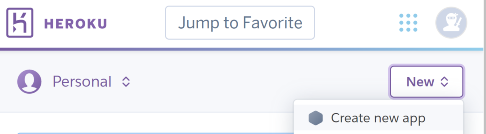

- ***Detailed information about setting up Heroku can be found [here](/README.md#heroku)***

*[As a developer, I can add my config vars to my app in Heroku so that I can allow deployment to production](https://github.com/chris-townsend/PP4-Kitchen_Tales/issues/2)*

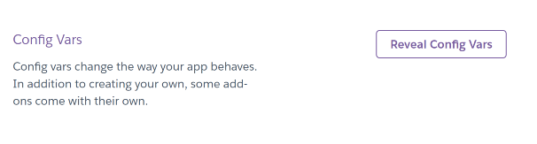
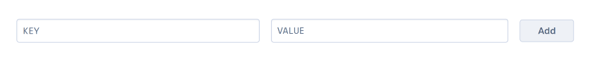

- ***Information about setting up the config vars within Heroku can be found [here](/README.md#create-the-heroku-app)***

*[As a developer, I can create a Procfile within my project so that the application will run in Heroku](https://github.com/chris-townsend/PP4-Kitchen_Tales/issues/3)*

- ***Information about setting up the Procfile can be found within the [Django](/README.md#within-gitpod) section of the readme***

*[As a developer, I can create a Cloudinary account so that I can store my media files](https://github.com/chris-townsend/PP4-Kitchen_Tales/issues/4)*

- ***Information about setting up the Cloudinary account can be found [here](/README.md#installing-django-and-supporting-libraries)***

*[As a developer, I can connect my GitHub account for the final deployment stages so that I can allow deployment to production](https://github.com/chris-townsend/PP4-Kitchen_Tales/issues/5)*

- ***Information about connecting my GitHub account through Heroku can be found [here](/README.md#create-the-heroku-app)***

#

### EPIC | *Initial Django Setup*
 

*[As a developer, I can set up Django and supporting libraries so that I can start developing the site](https://github.com/chris-townsend/PP4-Kitchen_Tales/issues/6)*

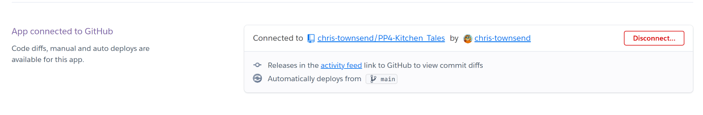

- ***Detailed information about the initial Django setup can be found [here](/README.md#installing-django-and-supporting-libraries) within the Django section of the README.md***

*[As a developer, I want to set up my environment to secure my private keys so that I do not expose them in an insecure way](https://github.com/chris-townsend/PP4-Kitchen_Tales/issues/7)*

- ***Information about setting up the environment safely can be found [here](/README.md#installing-django-and-supporting-libraries)***

*[As a developer, I should install the necessary Django components so that I can address authentication, registration, and account management for users](https://github.com/chris-townsend/PP4-Kitchen_Tales/issues/8)*

- ***Information about installing Django and supporting libraries can be found [here](/README.md#installing-django-and-supporting-libraries)***

*[As a developer, I should install the necessary Django components so that I can display a comments section that is more appealing to the user](https://github.com/chris-townsend/PP4-Kitchen_Tales/issues/9)*

- ***Information about installing Django components can be found [here](/README.md#installing-django-and-supporting-libraries)***

*[As a developer, I should set up the necessary database items so that the database is viewable through Heroku](https://github.com/chris-townsend/PP4-Kitchen_Tales/issues/40)*

- ***Information about setting up the ElephantSQL database can be found [here](/README.md#elephant-sql)***

#

### EPIC | *Website Functionality*
 

*[As a first-time user, I can immediately understand the purpose of the website, and I know if it's what I'm looking for](https://github.com/chris-townsend/PP4-Kitchen_Tales/issues/10)*

- The 'Welcome to Kitchen Tales' section when you first arrive on the homepage should be enough for users to understand the concept of the website, there is a button to sign up to create an account and share recipes. There is also an image of some cooked dishes and a menu.

*[As a User, I can view recipes, without having to sign-up to enjoy the site's content](https://github.com/chris-townsend/PP4-Kitchen_Tales/issues/11)*

- Any user can view all recipes from the recipes tab in the nav section at the top of every page.

*[As a User, I can view recipes on my mobile so that I don't have to rely on using a computer](https://github.com/chris-townsend/PP4-Kitchen_Tales/issues/13)*

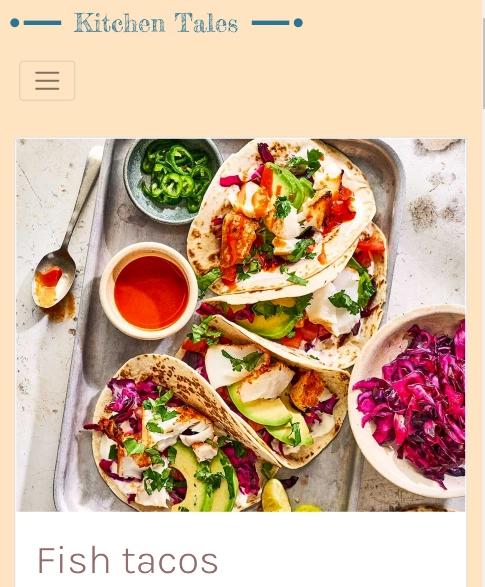

- The site was tested on a variety of devices to ensure it was mobile friendly, please click [here](/TESTING.md#device-testing) to view a full list of tested devices.

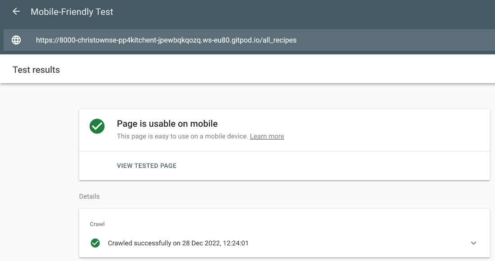

***For more detailed information about mobile testing, please click [here](#device-testing)***

*[As a User, I can view comments on recipes so that I can read other user's feedback](https://github.com/chris-townsend/PP4-Kitchen_Tales/issues/34)*

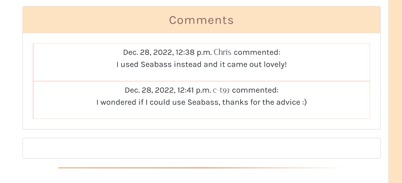

- The comments section is displayed below each recipe on a recipe detail page. Any user can view comments but you must be logged in to post, edit and delete comments.

*[As a Logged-in User, I can comment on recipes so that I can leave my feedback for others](https://github.com/chris-townsend/PP4-Kitchen_Tales/issues/35)*

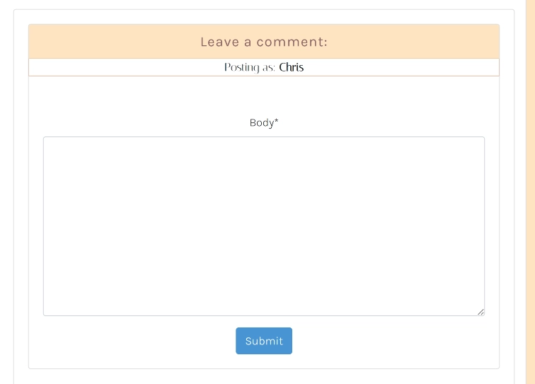

- When a user is logged in, a text field will be displayed for the user to post a comment below each recipe on a recipe detail page.

*[As a developer, I can add a favicon so that the site looks more distinguishable](https://github.com/chris-townsend/PP4-Kitchen_Tales/issues/41)*

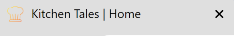

- A favicon has been created using [favicon.io](https://favicon.io/) to make the site look more distinguishable and professional. The image is hosted on Cloudinary and linked in the head of the `base` template.

#

### EPIC | *Navigation*
 

*[As a User, I can navigate around the site so that I can easily view desired content](https://github.com/chris-townsend/PP4-Kitchen_Tales/issues/14)*

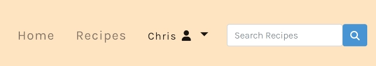

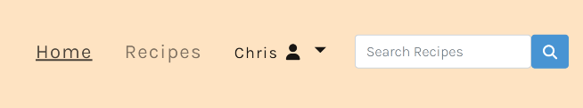

- Utilizing *CSS's* hover effect, the user know's what tab they are clicking on as it underlines the title. 

- A logged-in user can see their own dropdown-menu options by clicking on their name with the user icon. This menu gives the option for a user to add a new recipe, see there created recipes, their favourite starred recipes, and an option to log out of their account.

*[As a User, I can search for the desirable recipe by keyword so that I can find a specific recipe fast](https://github.com/chris-townsend/PP4-Kitchen_Tales/issues/15)*

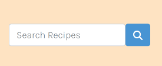

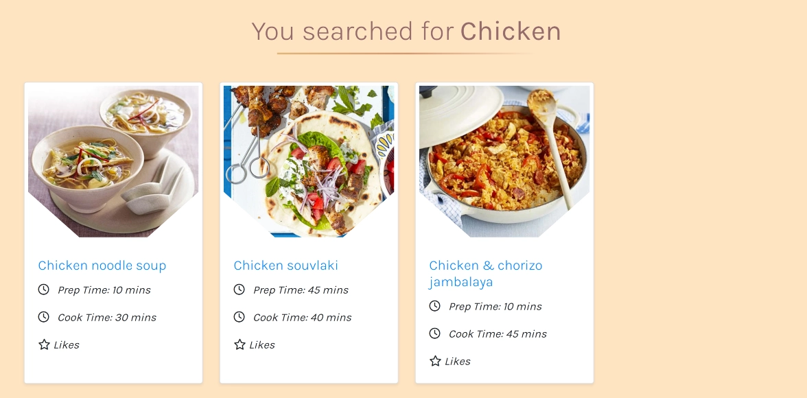

#

### EPIC | *User Recipe Management*
 

*[As a logged-in User, I can create recipes so that I can add them to the site](https://github.com/chris-townsend/PP4-Kitchen_Tales/issues/16)*

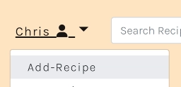

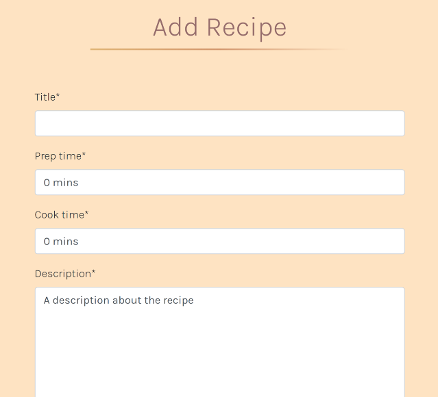

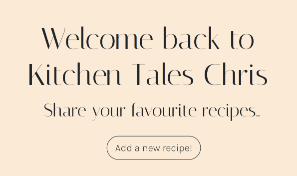

*[As a logged-in User, I can view all the recipes that I have created so that I can go back to them at a later date](https://github.com/chris-townsend/PP4-Kitchen_Tales/issues/17)*

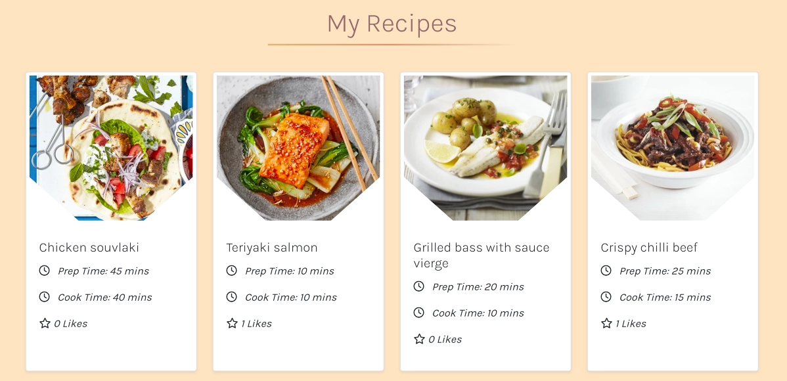

*[As a logged-in User, I can update and edit my recipes so that I can update any changes or mistakes that I have made](https://github.com/chris-townsend/PP4-Kitchen_Tales/issues/18)*

If the logged-in user is the author of the recipe, an edit button is shown next to the recipe image. When a user hovers over the edit button, it is displayed underlined.

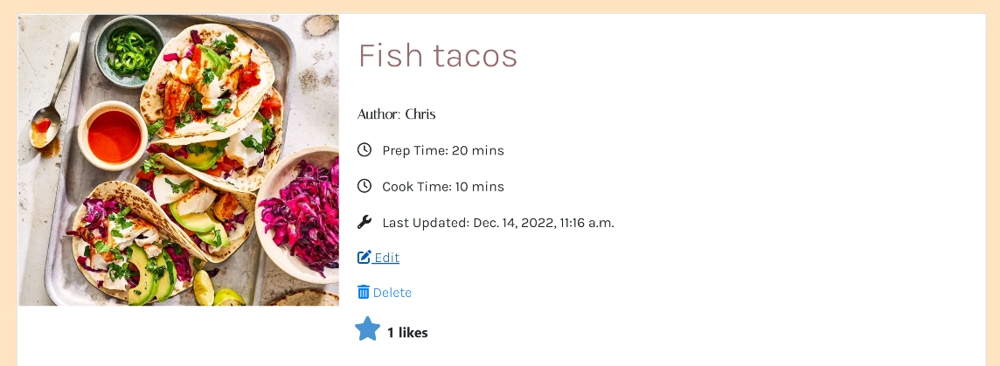

*[As a logged-in User, I can delete any personal recipes so that I can remove them if necessary](https://github.com/chris-townsend/PP4-Kitchen_Tales/issues/19)*

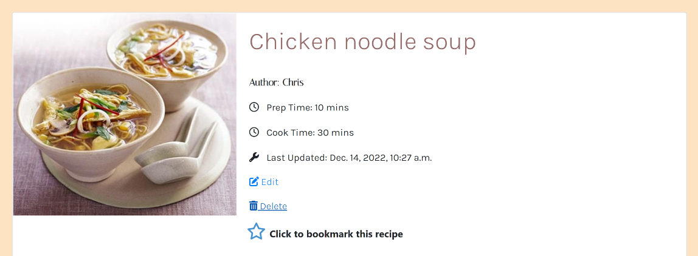
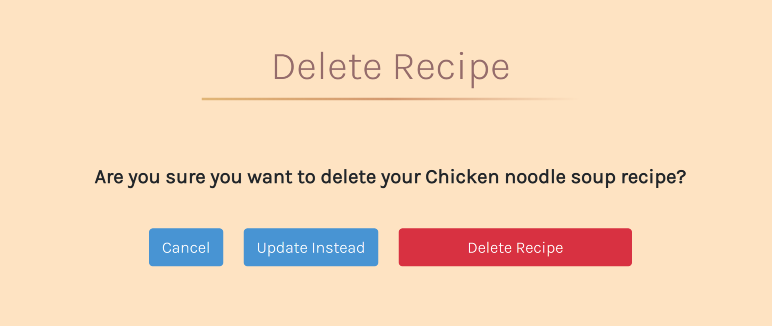

*[As a logged-in User, I can view my liked recipes so that I can return to them easily](https://github.com/chris-townsend/PP4-Kitchen_Tales/issues/39)*

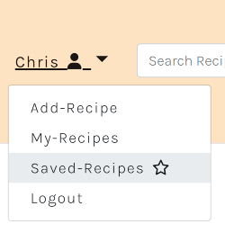

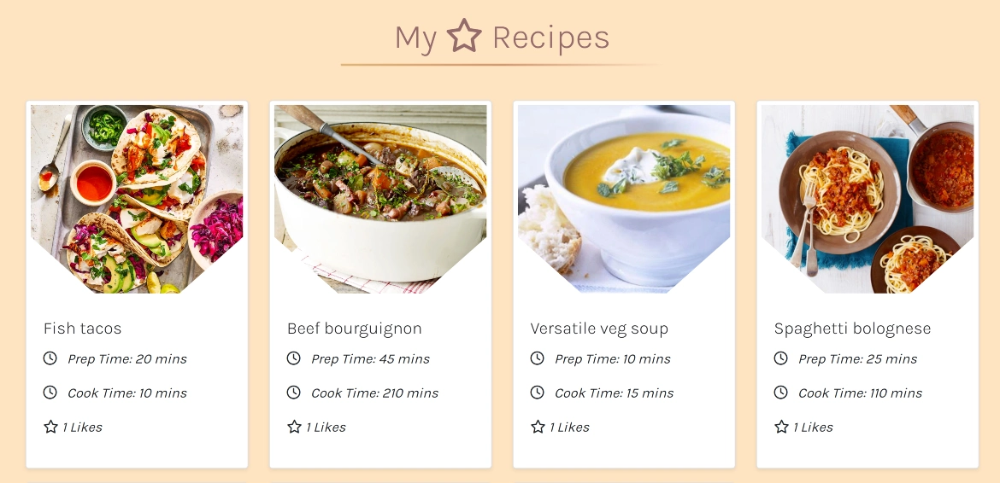

*[As a logged-in User, I can like or star a recipe so that I can bookmark it for later](https://github.com/chris-townsend/PP4-Kitchen_Tales/issues/42)*

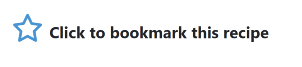

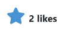

#

### EPIC | *User Account Management*
 

*[As a User, I can register for an account so that I can interact with the site content](https://github.com/chris-townsend/PP4-Kitchen_Tales/issues/22)*

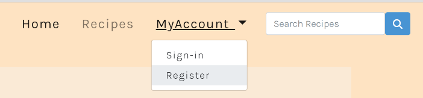

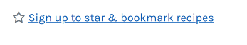

*[As a User, I can log into my account so that I can manage my recipes](https://github.com/chris-townsend/PP4-Kitchen_Tales/issues/24)*

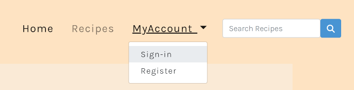

*[As a User, I can safely log out of my account so that I can disconnect from the site](https://github.com/chris-townsend/PP4-Kitchen_Tales/issues/25)*

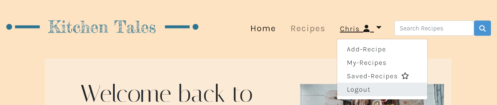

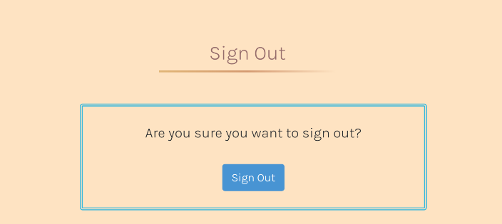

*[As a logged-in User, I can see my login status so that I know if I am logged in or out of my account](https://github.com/chris-townsend/PP4-Kitchen_Tales/issues/26)*

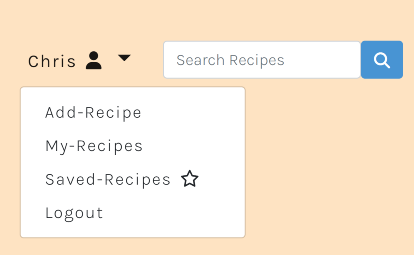

#

### EPIC | *Admin Features & Owner Objectives*
 

*[As a Site admin, I can create, edit and delete recipes and comments so that I can control the site content](https://github.com/chris-townsend/PP4-Kitchen_Tales/issues/28)*

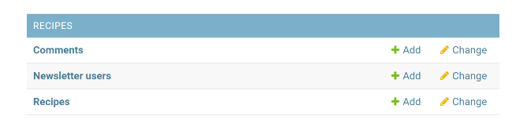

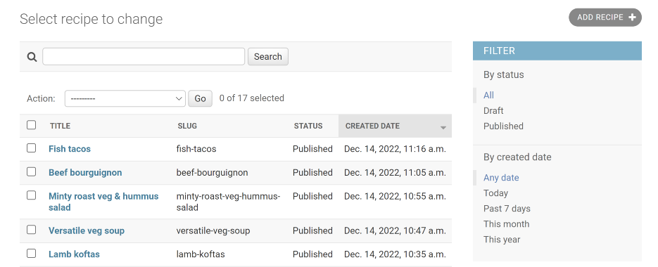

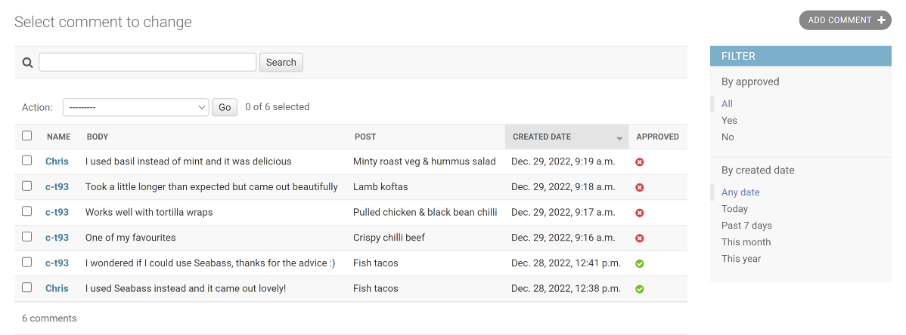

*[As a Site admin, I can authorize comments so that I can review the content before it's made public](https://github.com/chris-townsend/PP4-Kitchen_Tales/issues/29)*

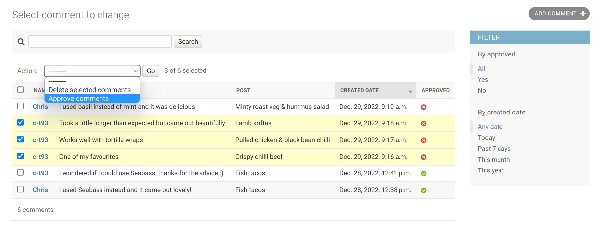

*[As a Site owner, I would like to display my social icons so that I can promote my other channels](https://github.com/chris-townsend/PP4-Kitchen_Tales/issues/31)*

 

[Back to top ⇧](#contents)
***

## Validator Testing

The *[W3C HTML validator](https://validator.w3.org/)* was used to test all HTML pages, **no errors** were reported in the final deployment.

### HTML

| Page                   | Status      |              | URL         |
| ---                    |   :---:     |    :---:     |    :---:    |
|                        | *logged-in* | *logged-out* |             |
|404.html                |             |              |             |
|500.html                |             |              |             |
|add_recipe.html         |   *pass*    |   *n/a*      |  *[result](https://validator.w3.org/nu/?showsource=yes&doc=https%3A%2F%2Fkitchen-tales.herokuapp.com%2Fadd_recipe%2F#l189c24)*           |
|all_recipes.html        |   *pass*    |   *pass*     |  *[result](https://validator.w3.org/nu/?doc=https%3A%2F%2Fkitchen-tales.herokuapp.com%2Fall_recipes%2F)*    |
|base.html               |   *pass*    |   *pass*     |  *[result](https://validator.w3.org/nu/?doc=https%3A%2F%2Fkitchen-tales.herokuapp.com%2F)*    |
|delete_comment.html     |   *pass*    |   *n/a*      |  *[result](https://validator.w3.org/nu/?showsource=yes&doc=https%3A%2F%2Fkitchen-tales.herokuapp.com%2Fdelete_comment%2F62%2F#l189c24)*           |
|delete_recipe.html      |   *pass*    |   *n/a*      | *[result](https://validator.w3.org/nu/?showsource=yes&doc=https%3A%2F%2Fkitchen-tales.herokuapp.com%2Fdelete_recipe%2F62%2F#l189c24)*   |
|footer.html             |   *pass*    |   *pass*     | *[result](https://validator.w3.org/nu/?doc=https%3A%2F%2Fkitchen-tales.herokuapp.com%2F)*    |
|index.html              |   *pass*    |   *pass*     | *[result](https://validator.w3.org/nu/?doc=https%3A%2F%2Fkitchen-tales.herokuapp.com%2F)*    | 
|my_recipes.html         |   *pass*    |   *n/a*      | *[result](https://validator.w3.org/nu/?showsource=yes&doc=https%3A%2F%2Fkitchen-tales.herokuapp.com%2Fmy_recipes%2F#l189c24)* |
|my_starred_recipes.html |   *pass*    |   *n/a*      |  *[result](https://validator.w3.org/nu/?showsource=yes&doc=https%3A%2F%2Fkitchen-tales.herokuapp.com%2Fmy_starred_recipes%2F#l189c24)*|
|newsletter.html         |   *pass*    |   *pass*     |  *[result](https://validator.w3.org/nu/?showsource=yes&doc=https%3A%2F%2Fkitchen-tales.herokuapp.com%2Fnewsletter#l189c24)*    |
|recipe_detail.html      |   *pass*    |   *pass*     |  *[result](https://validator.w3.org/nu/?showsource=yes&doc=https%3A%2F%2Fkitchen-tales.herokuapp.com%2Frecipe_detail%2Fbutternut-squash-sage-risotto%2F#l189c24)*    |
|recipe_paginator.html   |   *pass*    |    *pass*    |      -      |
|search_results.html     |   *pass*    |    *pass*    | *[result](https://validator.w3.org/nu/?doc=https%3A%2F%2Fkitchen-tales.herokuapp.com%2Fsearch_results%2F)* |
|update_comment.html     |   *pass*    |    *n/a*     | *[result](https://validator.w3.org/nu/?showsource=yes&doc=https%3A%2F%2Fkitchen-tales.herokuapp.com%2Fupdate_comment%2F62%2F#l189c24)*            |
|update_recipe.html      |   *pass*    |    *n/a*     | *[result](https://validator.w3.org/nu/?showsource=yes&doc=https%3A%2F%2Fkitchen-tales.herokuapp.com%2Fupdate_recipe%2F62%2F#l189c24)* |
|login.html              |   *pass*    |    *pass*    | *[result](https://validator.w3.org/nu/?showsource=yes&doc=https%3A%2F%2Fkitchen-tales.herokuapp.com%2Faccounts%2Flogin%2F#l189c24)*           |
|logout.html             |   *pass*    |    *n/a*     | *[result](https://validator.w3.org/nu/?showsource=yes&doc=https%3A%2F%2Fkitchen-tales.herokuapp.com%2Faccounts%2Flogout%2F#l189c24)*            |
|signup.html             |   *n/a*     |    *pass*    | *[result](https://validator.w3.org/nu/?showsource=yes&doc=https%3A%2F%2Fkitchen-tales.herokuapp.com%2Faccounts%2Fsignup#l189c24)*           |

***

### CSS 

The *[W3C CSS Validator](https://jigsaw.w3.org/css-validator/)* was used to validate the project, the results are shown below with **no errors reported.**

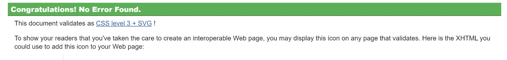

- *[ CSS results](https://jigsaw.w3.org/css-validator/validator?uri=https%3A%2F%2Fkitchen-tales.herokuapp.com%2F&profile=css3svg&usermedium=all&warning=1&vextwarning=&lang=en)*

***

### JavaScript

*[JSHint](https://jshint.com/)* was used to check the JavaScript within the base template. The JavaScript code has been placed in `<script>` tags at the bottom of the `base.html` template and as there is very little JavaScript code, I felt it was not worth placing in its own file. The results came back with no errors but a few undefined variables. I have left this as it is with a detailed comment above the variables to explain their function.

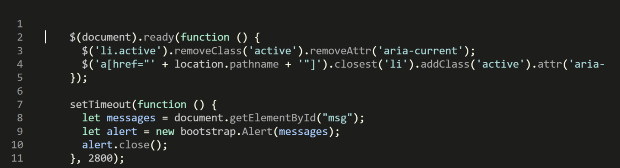
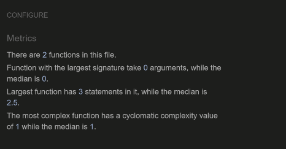

***

### Python

Code Institutes *[PEP8](https://pep8ci.herokuapp.com/)* linter was used to test the Python files. The table below shows the pages tested and their result, all pages are **error free** in the final deployment.

| Page                   | `kitchentales` |  `recipes`   | 
| ---                    |      :---:     |    :---:     |    
| `admin.py`             |     *n/a*      |    *pass*    |
| `apps.py`              |     *n/a*      |    *pass*    | 
| `forms.py`             |     *n/a*      |    *pass*    |
| `models.py`            |     *n/a*      |    *pass*    | 
| `urls.py`              |     *pass*     |    *pass*    |
| `views.py`             |     *n/a*      |    *pass*    |  
| `tests.py`             |                |              |

***

### Lighthouse 

I have run the website through Google Chrome's Lighthouse audit application and the results are shown below:
 
| Page                     |    Desktop     |    Mobile    | 
| ---                      |      :---:     |    :---:     |    
| `404.html`               |                |              |
| `500.html`               |                |              | 
| `add_recipe.html`        |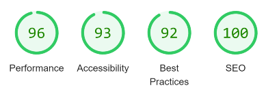         |          |
| `all_recipes.html`       |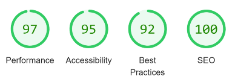        |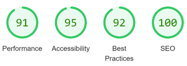  |
| `index.html`             |              |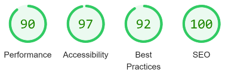               | 
| `delete_comment.html`    |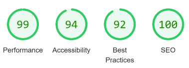     |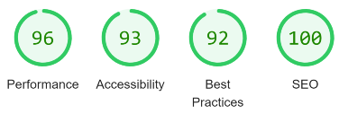              |
| `my-recipes.html`        |         |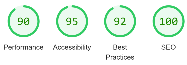          |  
| `my_starred_recipes.html`|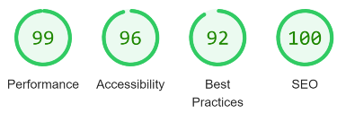   |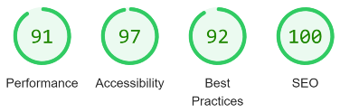              |
| `newsletter.html`        |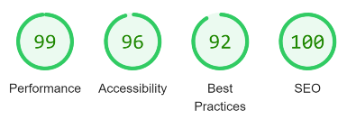         |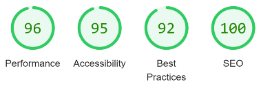              |
| `recipe_detail.html`     |      |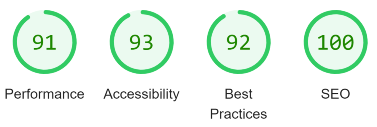              |
| `search_results.html`    |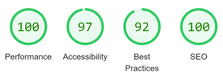    |              |
| `update_comment.html`    |    |              |
| `update_recipe.html`     |     |              |
| `login.html`             |  |              |
| `logout.html`            ||              | 
| `signup.html`            | |              |

 

The results are satisfactory and the suggested modification with regards to the issue within the console appears to give a lower score for *Best Practices* throughout mobile and desktop tests. Please see *[issue #64](https://github.com/chris-townsend/PP4-Kitchen_Tales/issues/64)* for further information regarding Audit usage of navigator.userAgent, navigator.appVersion & navigator.platform and a potential future issue to fix the current warning. The other suggestion is relating to the sizing of the site logo. This is a design choice, the image looks much better when it hasn't been cropped. If more time were available, image editing software could be utilised to edit the image but the effect is negligble. Overall the site runs better on desktop, the performace is low for mobile when adding and updating a recipe, this is mostly due to using summernote widgets for certain fields. This has been left as it is for now as the overall performace for the site is good. 

 

[Back to top ⇧](#contents)

***

## Browser Testing

The Website was tested on Google Chrome, Internet Explorer and Microsoft Edge with no issues reported. Family members and friends were asked to review the site and point out any bugs or problems if encountered.

***

## Device Testing

The website was viewed on a variety of devices such as Desktop, Laptop, Oneplus 5t, iPhone SE, iPhone 8, iPad & Samsung Galaxy S21 to ensure that the responsive design worked as intended. [Chrome DevTools](https://developer.chrome.com/docs/devtools/) was used to test the responsiveness on different devices.

***

## Manual Testing

### Desktop Homepage - *Navigation*
 

| Page/Status     | Element             |   Action    | Expected Result           | Pass/Fail   |
| ---             | ---                 |   :---:     |    :---:                  |    :---:    |
|**Homepage**     |**Navbar**           |             |                           |             |
|                 |*Home link*          |   *click*   | *Redirect to homepage*    |  **pass**   |
|                 |*Recipes link*       |   *click*   | *Open `all_recipes` page* |  **pass**   |
|                 |*Kitchen Tales logo* |   *click*   | *Redirect to homepage*    |  **pass**   |
|                 |*Search Recipes button*|   *click* | *Open `search_results` page*| **pass**  |
|                 |                     |   *hover*   | *Display lighter colour* |**pass**|
| **logged out**  |*MyAccount drop-down*|   *click*   | *Open drop-down menu*     |  **pass**   |  
|                 |*Sign-in link*       |   *click*   | *Open `login` page*       |  **pass**   |
|                 |*Register link*      |   *click*   | *Open `signup` page*      |  **pass**   |
| **logged in**   |*MyAccount drop-down*|  *display*  | *Change to username & user icon*|**pass**|
|                 |*Add-Recipe link*    |   *click*   | *Open `add_recipe` page*  |  **pass**   |
|                 |*My-Recipes link*    |   *click*   | *Open `my_recipes` page*  |  **pass**   |
|                 |*Saved-Recipes link* |   *click*   | *Open `my_starred_recipes` page*|**pass**|
|                 |*Logout link*        |   *click*   | *Open `logout` page*      |  **pass**   |
|                 |*All nav headings*   |   *hover*  |*Display darker text & underlined*| **pass** |

### Desktop Homepage - *Content*
 

| Page/Status     | Element             |   Action    | Expected Result     |   Pass/Fail     |
| ---             | ---                 |   :---:     |    :---:            |    :---:        |
|**Homepage**     |**Welcome to KT section**|         |                     |                 |
|                 | *Image*             | *display*   |*Image displayed*    | **pass**        |
|**logged-out**   |*Sign up today link* | *click*     |*Open `signup` page* | **pass**        |
|                 |                     | *hover*     |*Dark background/light text*| **pass** |
|**logged-in**    |*Welcome text*       | *display*   |*Welcome text with username*| **pass** |
|                 |*Add recipe link*    | *click*     |*Open `add_recipe` page* | **pass**    |
|                 |                     | *hover*     |*Dark background/light text*| **pass** | 
| **All users**   |**Image carousel section**|        |                     |                 |
|                 | *Images*            | *display*   |*Image displayed*    | **pass**        |
|                 |                     |*aria-label check*|*Display aria-labels* |           |
|                 | *Carousel-control button*| *click*|*Go to next image*   | **pass**        |
| **All users**   |**Card section**     |             |                     |                 |
|                 | *Images*            | *display*   |*Image displayed*    | **pass**        |
|                 |                     | *aria-label check*|*Display aria-labels*|           |
|                 |*Recipe App/Cheese Club images*|*hover*|*Rotate image 180°*| **pass**        |
| **All users**   |**Newsletter section**|            |                     |                 |
|                 | *Subscribe button*  | *click*     |*Open `newsletter` page* | **pass**    |
|                 |                     | *hover*     |*Dark background/light text*| **pass** |
|                 |

### Desktop Homepage - *Footer*
 

| Page/Status     | Element             |   Action    | Expected Result     |   Pass/Fail     |
| ---             | ---                 |   :---:     |    :---:            |    :---:        |
|**Homepage**     |**Social Icons**     | *click*     | *Open in a new tab* |  **pass**       |
|                 |                     | *hover*     | *Change scale **1.2***  |  **pass**   |
|                 |                     | *aria-label check*| *Display aria-labels*|          |

### Desktop *Recipes*
 

| Page/Status     | Element           |   Action      | Expected Result            | Pass/Fail   |
| ---             | ---               |   :---:       |    :---:                   |    :---:    |
|`all_recipes`    |**Navbar**         | *display*     | *Display navbar*           |   **pass**  |
|                 |**Recipe card**    |*display image*| *Correct recipe image clipped*|**pass**  |
|                 |  *Image*          |*hover*        | *Rotate image 180°*        | **pass**    |
|                 |  *Content*     |*display*|*Title, Cook & Prep time, Like counter*| **pass**  |
|                 |                   | *order display*|*Order from newest to oldest*| **pass**  |
|                 |                   | *click*       | *Open recipe detail page*    | **pass**  |
|                 |**Paginator buttons**  | *display*     |*Display pagination buttons if more than 8 recipes* | **pass**         |
|                 | ***Next** button* | *click*       |*Display next page of recipes*| **pass**   |
|                 |                   | *if clicked display*|*First/Previous buttons*| **pass**   |
|                 |                   | *hover*       | *Lighter background colour*  | **pass**   |
|                 | ***Last** button* | *click*       |*Display last page of recipes*| **pass**   |
|                 |                   | *hover*       | *Lighter background colour*  | **pass**   |
|                 | ***First** button*| *click*       |*Display first page of recipes*| **pass**  |
|                 |                   | *hover*       | *Lighter background colour*  | **pass**   |
|                 |***Previous** button*| *click*     |*Display previous page of recipes*| **pass**|
|                 |                   | *hover*       | *Lighter background colour*  | **pass**   |

### Desktop *Recipe Detail*
 

| Page/Status     | Element           |   Action      | Expected Result            | Pass/Fail   |
| ---             | ---               |   :---:       |    :---:                   |    :---:    |
|`recipe_detail`  |**Navbar**         | *display*     | *Display navbar*           |   **pass**  |
|                 |**Recipe Content** | *display*     | *Display image, title, author, Prep & Cook time, Last updated date and Like status*| **pass**    |
|                 |                    | *display*    |*Display ingredients & method side by side*| **pass**          |
|                 |**Comments**        | *display*    | *Comments from other users including date & comment author*| **pass**    |
|                 |                  | *display*     | *Comments are ordered from oldest to newest*|
|                 |**Social icons**    | *display*    | *Display social icons*     | **pass**    |
|                 |                    | *hover*      | *Change scale **1.2***     | **pass**    |
|**logged-out**   |*Star button & sign up link* |*click*| *Open `signup` page*     | **pass**    |
|                 |                           |*hover*| <u>*Underline text*</u>           | **pass**    |
|**logged-in**    |*Star button outline & text*| *click*| *Clicking the outlined star changes it to a solid star and displays number of likes*     | **pass** |
|                 |                    | *click*       | *Recipe saved to a logged-in users `my_starred_recipes`* | **pass**   | 
|                 |          | *click*| *Success message to alert the user that the recipe has been saved* | **pass**     |
|                 |*Star button solid state* | *click* | *Clicking the solid star changes it to an outline star*     | **pass** | 
|                 |                    |*click*        | *Remove saved recipe from a logged-in users `my_starred_recipes`* | **pass**   | 
|                 |                    |*click* | *Success message to alert the user that the recipe has been removed from their `my_starred_recipes`* | **pass**     |
|                 | **Comments**    | *display*    | *Text input box with submit button*| **pass**|
|                 | *Submit button* | *hover*    | *Lighter background colour* | **pass**     |
|                 |                 | *click*    |  *Form submits and the page updates* | **pass**  |
|                 |                 | *click*    | *Success message to alert the user that their comment is under review* | **pass**     |
|                 | No data         | *click*   | *Error message displayed and form won't submit* | **pass** | 
|**logged-in *author***|               | *display*       | **Edit** *&* **Delete** *buttons* | **pass**   |
|                      |*Edit & Delete buttons* | *hover*| *<u>Underline</u> & make text darker*| **pass**|
|                      | *Edit button*       |  *click*  | *Open `update_recipe` page* | **pass**|
|                      | *Delete button*     |  *click*  | *Open `delete_recipe` page* | **pass**|
|**logged-in *comment author*** |      | *display*       | **Edit** *&* **Delete** *buttons* | **pass**    |
|                      |*Edit & Delete Icons* | *hover*| *Display lighter colour*| **pass**   | 
|                      | *Edit comment button*       |  *click*  | *Open `update_comment` page* | **pass**|
|    | *Delete comment button*     |  *click*  | *Open `delete_comment` page*|**pass**|     

### Desktop *My Recipes*
 

| Page/Status     | Element           |   Action      | Expected Result            | Pass/Fail   |
| ---             | ---               |   :---:       |    :---:                   |    :---:    |
|`my_recipes`     |**Navbar**         | *display*     | *Display navbar*           |   **pass**  |
| **logged-in**   |`my_recipes` page  | *display*     | *Only display a logged-in users created recipes*| **pass**|
|                 |                   | *access*      | *If an unauthorized user tries to access this page by changing the URL, redirect to sign-in page*| **pass** |
|                 |**Recipe card**    |*display image*| *Correct recipe image clipped*|**pass**  |
|                 |  *Image*          |*hover*        | *Rotate image 180°*        | **pass**    |
|                 |  *Content*     |*display*|*Title, Cook & Prep time, Like counter*| **pass**  |
|                 |                   | *order display*|*Order from newest to oldest*| **pass**  |
|                 |                   | *click*        | *Open recipe detail page*   | **pass**  |
|                 |**Paginator buttons**  | *display*     |*Display pagination buttons if more than 8 recipes* | **pass**         |
|                 | ***Next** button* | *click*       |*Display next page of recipes*| **pass**   |
|                 |                   | *if clicked display*|*First/Previous buttons*| **pass**   |
|                 |                   | *hover*       | *Lighter background colour*  | **pass**   |
|                 | ***Last** button* | *click*       |*Display last page of recipes*| **pass**   |
|                 |                   | *hover*       | *Lighter background colour*  | **pass**   |
|                 | ***First** button*| *click*       |*Display first page of recipes*| **pass**  |
|                 |                   | *hover*       | *Lighter background colour*  | **pass**   |
|                 |***Previous** button*| *click*     |*Display previous page of recipes*| **pass**|
|                 |                   | *hover*       | *Lighter background colour*  | **pass**   |
|                 |**Footer**         | *display*     | *Social icons are displayed at the bottom of the page* | **pass**|
|                 |                   | *hover*      | *Change scale **1.2***     | **pass**    |        

### Desktop *My Starred Recipes*
 

| Page/Status     | Element           |   Action      | Expected Result            | Pass/Fail   |
| ---             | ---               |   :---:       |    :---:                   |    :---:    |
|`my_starred_recipes`|**Navbar**         | *display*     | *Display navbar*        |   **pass**  |
| **logged-in**   |`my_starred_recipes` page  | *display*     | *Only display a logged-in users starred recipes*| **pass**|
|                 |                   | *access*      | *If an unauthorized user tries to access this page by changing the URL, redirect to sign-in page*| **pass** |
|                 |**Recipe card**    |*display image*| *Correct recipe image clipped*|**pass**  |
|                 |  *Image*          |*hover*        | *Rotate image 180°*        | **pass**    |
|                 |  *Content*     |*display*|*Title, Cook & Prep time, Like counter*| **pass**  |
|                 |                   | *order display*|*Order from newest to oldest*| **pass**  |
|                 |                   | *click*        | *Open recipe detail page*   | **pass**  |
|                 |**Paginator buttons**  | *display*     |*Display pagination buttons if more than 8 recipes* | **pass**         |
|                 | ***Next** button* | *click*       |*Display next page of recipes*| **pass**   |
|                 |                   | ***if** clicked display*|*First/Previous buttons*| **pass**   |
|                 |                   | *hover*       | *Lighter background colour*  | **pass**   |
|                 | ***Last** button* | *click*       |*Display last page of recipes*| **pass**   |
|                 |                   | *hover*       | *Lighter background colour*  | **pass**   |
|                 | ***First** button*| *click*       |*Display first page of recipes*| **pass**  |
|                 |                   | *hover*       | *Lighter background colour*  | **pass**   |
|                 |***Previous** button*| *click*     |*Display previous page of recipes*| **pass**|
|                 |                   | *hover*       | *Lighter background colour*  | **pass**   |
|                 |**Footer**         | *display*     | *Social icons are displayed at the bottom of the page* | **pass**|
|                 |                   | *hover*      | *Change scale **1.2***     | **pass**    |

### Desktop *Django All Auth Pages*
 

| Page/Status     | Element           |   Action          | Expected Result            | Pass/Fail   |
| ---             | ---               |   :---:           |    :---:                   |    :---:    |
|`signup`         |**Navbar**         | *display*         | *Display navbar*           |   **pass**  |
|                 | *Login link*      | *click*           | *Redirect to `login` page*  |   **pass**  |
|                 | ***Username field***  | *leave empty*     |  *Error message*           | **pass**    |
|                 |                   | *enter valid data*| *Form submits*             |  **pass**   |
|                 |                   | *enter invalid format* | *Form won't submit*   | **pass**    | 
|                 |                   | *enter invalid format* | *Error message*       | **pass**    |
|                 | ***Email field***     | *leave empty*       | *Form submits*           | **pass**    | 
|                 |                   | *enter invalid format*|  *Error message*       | **pass**    |
|                 |                   | *enter invalid format*| *Form won't submit*    | **pass**    |
|                 |                   | *enter valid data*| *Form submits*             | **pass**    |
|                 | ***Password field***  | *leave empty*       | *Error message*          | **pass**    |
|                 |                   | *enter valid data*| *Form submits*             |  **pass**   |
|                 |                   | *password not match* | *Error message*         | **pass**    |
|                 |                   | *password not match* | *Form won't submit*     | **pass**    |
|                 | ***Signup button*** | *hover*            |*Lighter background colour*|**pass**   |
|                 |                   | *click*         | *Form submits*          | **pass**    |
|                 |                   | *click*         | *Return to homepage*    | **pass**    |
|                 |                   | *click*         | *Success message to alert the user of a successful login* | **pass** |
|                 |                   |                     | *Automatically close alert after 2.8sec*| **pass**  |
|`login`         |**Navbar**         | *display*         | *Display navbar*           |   **pass**  |
|                 | *Sign up link*      | *click*           | *Redirect to `signup` page*  |   **pass**  |
|                 | ***Username field***  | *leave empty*     |  *Error message*           | **pass**    |
|                 |                   | *enter valid data*| *Form submits*             |  **pass**   |
|                 |                   | *enter invalid format* | *Form won't submit*   | **pass**    | 
|                 |                   | *enter invalid format* | *Error message*       | **pass**    |
|                 | ***Password field***  | *leave empty*       | *Error message*          | **pass**    |
|                 |                   | *enter valid data*| *Form submits*             |  **pass**   |
|                 |                   | *password not match* | *Error message*         | **pass**    |
|                 |                   | *password not match* | *Form won't submit*     | **pass**    |
|                 | ***Sign-in button***| *hover*            | *Lighter background colour* | **pass**|
|                 |                         | *click*    | *Form submits*          | **pass**    |
|                 |                   | *click*         | *Return to homepage*    | **pass**    |
|                 |                   | *click*         | *Success message to alert the user of a successful login* | **pass** |
|                 |                   |                      | *Automatically close alert after 2.8sec*| **pass**  |
|`logout`         |**Navbar**         | *display*         | *Display navbar*           |   **pass**  |
|                 |***Signout button***| *hover*          | *Lighter background colour*| **pass**    |
|                 |                   | *click*    | *Form submits*               | **pass**    |
|                 |                   | *click*         | *Return to homepage*    | **pass**    |
|                 |                   | *click*         | *Success message to alert the user of a successful logout* | **pass** |
|                 |                   |                 | *Automatically close alert after 2.8sec*| **pass**  |
|                 |**Footer**         | *display*     | *Social icons are displayed at the bottom of the page* | **pass**|
|                 |                   | *hover*      | *Change scale **1.2***     | **pass**    |

### Desktop *Add recipe*
 

| Page/Status     | Element           |   Action          | Expected Result            | Pass/Fail   |
| ---             | ---               |   :---:           |    :---:                   |    :---:    |
|`add_recipe`     |**Navbar**         | *display*         | *Display navbar*           |   **pass**  |
|                 |                   | *access*          | *If an unauthorized user tries to access this page by changing the URL, redirect to sign-in page*| **pass** |
|  **logged-in**  | **Form**          | *leave empty*     |  *Form won't submit*       | **pass**    |
|                 |                   | *display*      | *Summernote display for ingredients, method and notes*| **pass**  | 
|                 | *Image **Choose file** button*| *click*        | *Open device storage*      | **pass**    |
|                 |                | *display*      | *Placeholder image if no image selected*| **pass**|
|                 |                  | *display*      | *selected image name displayed*| **pass** |
|                 | ***Title field*** |  *no duplicates*   | *Error message*            | **pass**    |
|                 |                  |  *no duplicates*   | *Form won't submit*        | **pass**    |
|                 |                  | *max length* |*No more than 48 characters long* | **pass**    |
|                 |***Prep & Cook time field***| *display*          | *default 0 mins*             |**pass**     |   
|                 |                 | *max length*|*No more than 8 characters long* | **pass**     |
|                 | ***Cancel button*** | *hover* | *Lighter background colour*     | **pass**     |
|                 |                     | *click* | *Redirct to `all_recipes`*      | **pass**     |
|                 | ***Add recipe button*** | *hover* | *Lighter background colour* | **pass**     |
|                 |                     | *click* | *Form submits*                  | **pass**     |
|                 |                     | *click* | *Go to newly created `recipe_detail` page*| **pass**     |
|                 |                     | *click* | *Success message to alert the user of a successfully added new recipe* | **pass** |
|                 |          |          | *Automatically close alert after 2.8sec*  | **pass**     |
|                 |**Footer**         | *display*     | *Social icons are displayed at the bottom of the page* | **pass**|
|                 |                   | *hover*      | *Change scale **1.2***     | **pass**    |

### Desktop *Update recipe*
 

| Page/Status     | Element           |   Action          | Expected Result            | Pass/Fail   |
| ---             | ---               |   :---:           |    :---:                   |    :---:    |
|`update_recipe`     |**Navbar**         | *display*         | *Display navbar*           |   **pass**  |
|                 |                   | *access*          | *If an unauthorized user tries to access this page by changing the URL, redirect to sign-in page*| **pass** |
|                 |  ***Form***       | *display*         |*Prepopulated data with last recipe content*| **pass** |
|                 |                   | *leave field empty* | *Form won't submit* | **pass**        |
|                 | ***Cancel button*** | *hover* | *Lighter background colour*     |      **pass**   |
|                 |                     | *click* | *Redirct to last `recipe_detail` page*| **pass**  |
|                 |***Update recipe button*** | *hover* | *Lighter background colour* | **pass**     |
|                 |                     | *click* | *Form submits*                  | **pass**     |
|                 |                     | *click* | *Go to updated `all_recipes` page*| **pass**     |
|                 |                     | *click* | *Success message to alert the user of successful update of their recipe* | **pass** |
|                 |          |          | *Automatically close alert after 2.8sec*  | **pass**     |
|                 |**Footer**         | *display*     | *Social icons are displayed at the bottom of the page* | **pass**|
|                 |  

### Desktop *Delete recipe*
 

| Page/Status     | Element           |   Action          | Expected Result            | Pass/Fail   |
| ---             | ---               |   :---:           |    :---:                   |    :---:    |
|`delete_recipe`     |**Navbar**         | *display*         | *Display navbar*           |   **pass**  |
|                 |                   | *access*          | *If an unauthorized user tries to access this page by changing the URL, redirect to sign-in page*| **pass** |
|                 | ***Text***           | *display*   |  *Display recipe_title within text*| **pass** | 
|                 | ***Cancel button*** | *hover* | *Lighter background colour*     |      **pass**   |
|                 |                     | *click* | *Redirct to last `recipe_detail` page*| **pass**  |
|                 |***Update instead button*** | *hover* | *Lighter background colour* | **pass**     |
|                 |                     | *click* | *Go to `update_recipe` page with populated data*| **pass**      |
|                 | ***Delete button*** | *display*| *Warning red coloured box*| **pass**             |
|                 |                     | *hover* | *Darker background colour*     |      **pass**    |
|                 |                     | *click* | *Recipe removed from database* | **pass**
|                 |                     | *click* | *Redirct to `my_recipes` page*| **pass**  |
| |   |*click* | *Success message to alert the user of successfully deleting their recipe* | **pass** |
|                 |          |          | *Automatically close alert after 2.8sec*  | **pass**     |
|                 |**Footer**         | *display*     | *Social icons are displayed at the bottom of the page* | **pass**|
|                 |  

***

## Bugs

Issues were created on GitHub and noted with a `bug` label.
 

### Fixed Bugs

1. [auth.User.None displayed next to the 'star' icon](https://github.com/chris-townsend/PP4-Kitchen_Tales/issues/43)

*resolved - [593fc8e](https://github.com/chris-townsend/PP4-Kitchen_Tales/commit/593fc8e319ec4791a2098c2a25d226258d64b89c) The wrong item was being rendered
into the template*

`{{ recipe.like_recipe }` --> `{{ recipe.number_of_likes }}`

2. [Alert message not being displayed within coloured alert box](https://github.com/chris-townsend/PP4-Kitchen_Tales/issues/44)

*resolved - [5e7e796](https://github.com/chris-townsend/PP4-Kitchen_Tales/commit/5e7e796bee681e03ead4b4b709886dc166542865) Missing closing div tag*

3. [IntegrityError when a logged-in user attempts to submit a comment](https://github.com/chris-townsend/PP4-Kitchen_Tales/issues/45)

*resolved - missing line of code within the if/else statement of the post function*

`comment.post_id = recipe.id` in `views.py`

4. [Comment approval alert not being displayed in the correct place](https://github.com/chris-townsend/PP4-Kitchen_Tales/issues/46)

*resolved - [62976b1](https://github.com/chris-townsend/PP4-Kitchen_Tales/commit/62976b1af0ec5fe870a5f92f0817c221d44ac1d5)*

 *Import messages from django.contrib -*  `from django.contrib import messages`

 *Add success message to post variable after the comment gets saved -* 

  `messages.success(self.request, 'Your comment is awaiting approval')`

5. [FieldError within Recipe model form](https://github.com/chris-townsend/PP4-Kitchen_Tales/issues/47)

*resolved - Follow error code and remove `created_date` from the fields*

6. [NameError: 'self' is not defined within MyRecipesView](https://github.com/chris-townsend/PP4-Kitchen_Tales/issues/49)

*resolved - Create a function that modifies the original queryset to only display recipes created by the logged-in user*

7. [Incorrect link from 'Sign up to star & bookmark recipes'](https://github.com/chris-townsend/PP4-Kitchen_Tales/issues/48)

*resolved - [93eaa72](https://github.com/chris-townsend/PP4-Kitchen_Tales/commit/93eaa7205849792b3e41595496f019574fcf062f)*

*Change the link to the correct location - `<a href=""`*

8. [The search icon is not being displayed correctly](https://github.com/chris-townsend/PP4-Kitchen_Tales/issues/50)

*resolved - [bbd95c7](https://github.com/chris-townsend/PP4-Kitchen_Tales/commit/bbd95c76d0b86f47692c8d768e7f6b2e56a592aa)*

*Create a form and style with bootstrap classes*

9. [NoReverseMatch error after setting an incorrect URL to cancel deleting a comment on a recipe](https://github.com/chris-townsend/PP4-Kitchen_Tales/issues/51)

*resolved - [3a01ac0](https://github.com/chris-townsend/PP4-Kitchen_Tales/commit/3a01ac05a1eff73fb020401b637e8d154e9d33c4)*

*Change the href within the `delete_comment.html` template to cancel deleting a comment.* Add missing code `.post` from the Comment model.

10. [Navbar 'active' class not working correctly after page change](https://github.com/chris-townsend/PP4-Kitchen_Tales/issues/52)

*resolved - Remove the current **active** class from Home in the base template. Add JavaScript to manage the `<li>` items when active and remove them when a user changes the page.*

*Credit - [Bootstrap navbar Active State not working](https://stackoverflow.com/questions/24514717/bootstrap-navbar-active-state-not-working)*

11. [Placeholder image automatically added to a new recipe instead of the user uploaded image](https://github.com/chris-townsend/PP4-Kitchen_Tales/issues/53)

*resolved - [09f9c79](https://github.com/chris-townsend/PP4-Kitchen_Tales/commit/09f9c79793272f6c000d202c9f3f30df8cb2f6bd)*

*Missing code within `AddRecipeView` in `views.py` - `recipe.image = request.FILES['image']`*

12. [MultiValueDictKeyError when a user goes to update a recipe](https://github.com/chris-townsend/PP4-Kitchen_Tales/issues/54)

*resolved - [aa6c9f8](https://github.com/chris-townsend/PP4-Kitchen_Tales/commit/aa6c9f8e8344f044ba26c53f23bbb3b82e9ed7e3)*

*Add correct line of code and remove commented out unused code*

#

### Unfixed Bugs

1. [Placeholder image automatically set when updating a recipe](https://github.com/chris-townsend/PP4-Kitchen_Tales/issues/55)

*When a user goes to update their recipe, the placeholder image replaces their own image unless it has been specified again. This should be an easy fix by adding to the if/else statement*

***

## Automated Testing

A number of unit tests were written to test key interactions between the views and the database models. These can be found in the [`tests`](https://github.com/chris-townsend/PP4-Kitchen_Tales/blob/main/tests/) folder.

#

 

[Back to top ⇧](#contents)

[Back to *README.md*](/README.md#testing)
***

